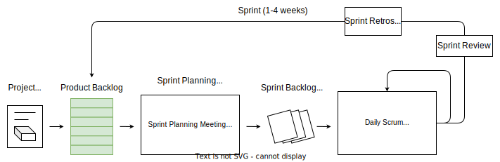
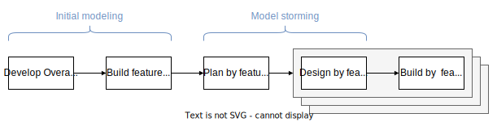
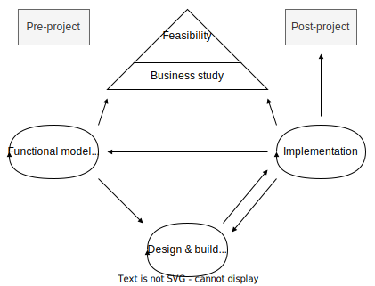
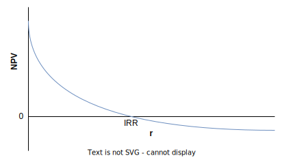

# Agile Domains, Tools, and Techniques

Notes from Mike Griffith, *PMI-ACP Exam Prep,* Second Edition.

## Introduction

### Domains

| Domain                                            | Weight | Sub-Domain                        |
| ------------------------------------------------- | ------ | --------------------------------- |
| Agile Principles and Mindset                      | 16%    |                                   |
| Value-Driven Delivery                             | 20%    | Define Positive Value             |
|                                                   |        | Avoid Potential Downsides         |
|                                                   |        | Prioritization                    |
|                                                   |        | Incremental Development           |
| Stakeholder Engagement                            | 17%    | Understand Stakeholder Needs      |
|                                                   |        | Ensure Stakeholder Involvement    |
|                                                   |        | Manage Stakeholder Expectations   |
| Team Performance                                  | 16%    | Team Formation                    |
|                                                   |        | Team Empowerment                  |
|                                                   |        | Team Collaboration and Commitment |
| Adaptive Planning                                 | 12%    | Levels of Planning                |
|                                                   |        | Adaptation                        |
|                                                   |        | Agile Sizing and Estimation       |
| Problem Detection and Resolution                  | 10%    |                                   |
| Continuous Improvement (Product, Process, People) | 9%     |                                   |

### Tools and Techniques

| Toolkit                            | Tool/Technique                                                 |
| ---------------------------------- | -------------------------------------------------------------- |
| Agile Analysis and Design         | Product Roadmap                                                |
|                                    | User Stories/Backlog                                           |
|                                    | Story Maps                                                     |
|                                    | Progressive Elaboration                                        |
|                                    | Wireframes                                                     |
|                                    | Chartering                                                     |
|                                    | Personas                                                       |
|                                    | Agile Modeling                                                 |
|                                    | Workshops                                                      |
|                                    | Learning Cycle                                                 |
|                                    | Collaboration Games                                            |
| Agile Estimation                   | Relative sizing/story points/T-shirt sizing                    |
|                                    | Wide ban Delphi/Planning Poker                                 |
|                                    | Affinity Estimation                                            |
|                                    | Ideal Time                                                     |
| Communications                     | Information Radiator                                           |
|                                    | Team Space Agile Tooling                                       |
|                                    | Osmotic Communications for Co-located and/or Distributed Teams |
|                                    | Two-way Communications (Trustwhorty, Conversation Driven)      |
|                                    | Socia-media based Communication                                |
|                                    | Active Listening                                               |
|                                    | Brainstorming                                                  |
|                                    | Feedback Methods                                               |
| Interpersonal Skills               | Emotional Intelligence                                         |
|                                    | Collaboration                                                  |
|                                    | Adaptive Leadership                                            |
|                                    | Servant Leadership                                             |
|                                    | Negotiation                                                    |
|                                    | Conflict Resolution                                            |
| Metrics                            | Velocity/Throughput/Productivity                               |
|                                    | Cycle Time                                                     |
|                                    | Lead Time                                                      |
|                                    | EVM for Agile Projects                                         |
|                                    | Defect Rate                                                    |
|                                    | Approved Iterations                                            |
|                                    | Work in Progress                                               |
| Planning, Monitoring, and Adapting | Reviews                                                        |
|                                    | Kanban Board                                                   |
|                                    | Task Board                                                     |
|                                    | Timeboxing                                                     |
|                                    | Iteration and Release Planning                                 |
|                                    | Variance and Trend Analysis                                    |
|                                    | WIP Limits                                                     |
|                                    | Daily Stand Ups                                                |
|                                    | Burn down/up Charts                                            |
|                                    | Cumulative Flow Diagram                                        |
|                                    | Backlog Grooming/Refinement                                    |
|                                    | Product-feedback Loop                                          |
| Process Improvement                | Kaizen                                                         |
|                                    | Five WHYs                                                      |
|                                    | Retrospectives, Intraspectives                                 |
|                                    | Process Tailoring/Hybrid Models                                |
|                                    | Value Stream Mapping                                           |
|                                    | Control Limits                                                 |
|                                    | Pre-mortem (Rule Setting, Failure Analysis)                    |
|                                    | Fishbone Diagram Analysis                                      |
| Product Quality                    | Frequent Verification and Validation                           |
|                                    | Definition of Done                                             |
|                                    | Continuous Integration                                         |
|                                    | Testing, Including Exporatory and Usability                    |
| Risk Management                    | Risk Adjusted Backlog                                          |
|                                    | Risk Burn Down Graphs                                          |
|                                    | Risk-based Spike                                               |
|                                    | Architectural Spike                                            |
| Value-Based Prioritization        | ROI/NPV/IRR                                                    |
|                                    | Compliance                                                     |
|                                    | Customer Value Prioritization                                  |
|                                    | Requirements Reviews                                           |
|                                    | Minimal Viable Product (MVP)                                   |
|                                    | Minimal Marketable Feature (MMF)                               |
|                                    | Relative Prioritization/Ranking                                |
|                                    | MoSCoW                                                         |
|                                    | Kano Analysis                                                  |

## Agile Principles and Mindset

### The Agile Mindset

#### Declaration of Interdependence (DOI)

* Written in 2005 by Agile Project Leadership Network
* Six Precepts:

> 1. We increase **return on investment** by making continuous flow of value our focus.
> 2. We **deliver reliable results** by engaging customers in frequent interactions and shared ownership.
> 3. We **expect uncertainty** and manage for it through iterations, anticipation, and adaptation.
> 4. We **unleash creativity** and innovation by recognizing that individuals are the ultimate source of value, and creating an environment where they can make a difference.
> 5. We **boost performance** through group accountability for results and shared responsibility for team effectiveness.
> 6. We **improve effectiveness and reliability** through situationally specific strategies, processes, and practices.

#### The Agile Triangle

| Methodology | Constraint | Variable   |
| ----------- | ---------- | ---------- |
| Predictive  | Scope      | Time, Cost |
| Agile       | Time, Cost | Scope      |

### The Agile Manifesto

#### Four Values

> **Individuals and interactions** over processes and tools
>
> **Working software** over comprehensive documentation
>
> **Customer collaboration** over contract negotiation
>
> **Responding** to change over following a plan

#### Twelve Principles

> Our highest priority is to satisfy the customer through early and continuous delivery of valuable software.
>
> Welcome changing requirements, even late in development. Agile processes harness change for the customer's competitive advantage.
>
> Deliver working software frequently, from a couple of weeks to a couple of months, with a preference to the shorter timescale.
>
> Business people and developers must work together daily throughout the project.
>
> Build projects around motivated individuals. Give them the environment and support they need, and trust them to get the job done.
>
> The most efficient and effective method of conveying information to and within a development team is face-to-face conversation.
>
> Working software is the primary measure of progress.
>
> Agile processes promote sustainable development. The sponsors, developers, and users should be able to maintain a constant pace indefinitely.
>
> Continuous attention to technical excellence and good design enhances agility.
>
> Simplicity---the art of maximizing the amount of work not done---is essential.
>
> The best architectures, requirements, and designs emerge from self-organizing teams.
>
> At regular intervals, the team reflects on how to become more effective, then tunes and adjust sits behavior accordingly.

### Agile Methodologies

* Scrum
* Extreme Programming (XP)
* Lean Product Development
* Kanban
* Feature-driven Development (FDD)
* Dynamic Systems Development Method (DSDM)
* Crystal

#### Scrum

##### Process

|  |
| :--------------------------------------: |
|              Scrum Process              |

##### Principles

* Transparency
* Inspection
* Adaptation

##### Values

* Focus
* Courage
* Openness
* Commitment
* Respect

##### Sprints

* Sprint = timeboxed iteration of < 1 month
* No changes affecting the sprint goal are made throughout the sprint
* Scope can be clarified/renegotiated as new information becomes available
* Can be cancelled by Product Owner before timebox is over due to
  * goal becomes obsolete
  * change in business direction/technology conditions
  * sequence of Activities

    1. Sprint Planning Meeting
    2. Development period
       * Daily scrums
       * Sprint review meeting
       * Sprint retrospective meeting

##### Team Roles

* Product Owner
* Scrum Master
* Development Team

##### Activities (Events/Ceremonies)

* Product Backlog Refinement
* Sprint Planning Meeting
* Daily Scrums
* Sprint Reviews
* Sprint Retrospectives

##### Artifacts

* Product Increment
* Product Backlog
* Sprint Backlog

#### Extreme Programming (XP)

##### Core Values

* Simplicity
* Communication
* Feedback
* Courage
* Respect

##### Team Roles

* Coach
* Customer
* Programmers
* Testers

##### Practices

* Whole Team
* Planning Games
* Small Releases
* Customer Tests
* Collective Code Ownership
* Code Standards
* Sustainable Pace
* Metaphor
* Continuous Integration
* Test-Driven Development
* Refactoring
* Simple Design
* Pair Programming

#### Lean Product Development

##### Core Concepts

* Eliminate waste
* Empower team
* Deliver fast
* Optimize the whole
* Build quality in
* Defer decisions
* Amplify learning

##### Seven Wastes

* Partially done work
* Extra processes
* Extra features
* Task switching
* Waiting
* Motion
* Defects

#### Kanban

| To Do | In Progress | Done |
| ----- | ----------- | ---- |
| G     | C           | A    |
| H     | D           | B    |
| I     | E           |      |
| J     | F           |      |

##### Principles

* Visualize workflow
* Limit WIP
* Manage flow
* Make process policies explicit
* Improve collaboratively

##### WIP Limits

$\downarrow$ WIP $\rightarrow$ $\uparrow$ Team's productivity

Little's Law: $Queue.Duration = m(Queue.Size)$

| Backlog | Selected (4) | Develop (3) | Acceptance (2) | Deploy |
| ------- | ------------ | ----------- | -------------- | ------ |
| L       | I            | F           | E              | A      |
| M       | J            | G           |                | B      |
| N       | K            | H           |                | C      |
| O       |              |             |                | D      |
| P       |              |             |                |        |
| Q       |              |             |                |        |

#### Feature-driven Development (FDD)

##### Process

|  |
| :----------------------------------: |
|             FDD Process             |

##### Practices

* Domain object modeling
* Developing by feature
* Individual class (code) ownership
* Feature teams
* Inspections
* Configuration management
* Regular builds
* Visibility of progress/results

#### Dynamic Systems Development Method (DSDM)

##### Process

|  |
| :------------------------------------: |
|              DSDM Process              |

##### Principles

* Focus on the business needs
* Deliver on time
* Collaborate
* Never compromise quality
* Build incrementally from firm foundations
* Develop iteratively
* Communicate continuously and clearly
* Demonstrate control

#### Crystal

Crystal = family of situationally specific, customzied methodologies coded by color names

$Criticality = f(Defect.Impact)$

| Criticality         | Clear        | Yellow        | Orange        | Red            | Magenta        |
| ------------------- | ------------ | ------------- | ------------- | -------------- | -------------- |
| Life                | L6           | L20           | L40           | L100           | **L200** |
| Essential funds     | E6           | **E20** | **E40** | **E100** | **E200** |
| Discretionary funds | **D6** | **D20** | **D40** | **D100** | **D200** |
| Comfort             | **C6** | **C20** | **C40** | **C100** | **C200** |
|                     |              |               |               |                |                |
| Team size           | 1-6          | 7-20          | 21-40         | 41-100         | 101-200        |

### Agile Leadership

Align project objectives with personal objectives to improve productivity

#### Management versus Leadership

| Management Focus   | Leadership             |
| ------------------ | ---------------------- |
| Tasks/things       | People                 |
| Control            | Empowerment            |
| Efficiency         | Effectiveness          |
| Doing things right | Doing the right things |
| Speed              | Direction              |
| Practices          | Principles             |
| Command            | Communication          |

### Servant Leadership

#### Duties

* Shield the team from interruptions
* Remove impediments to progress
* Communicate
* "Carry food and water"

## Value-Driven Delivery

### Assessing Value

#### Financial Assessment Metrics

##### Return on Investment (ROI)

Formula: $ROI = Investment.Benefits/Investment.Cost$

Interpretation: $ROI>1$

##### Present Value (PV)

Formula: $PV = FV_t/(1+r)^t$

##### Net Present Value (NPV)

Formula: $NPV=\sum_{t=0}^{T} CF_t/(1+r)^t$

Interpretation:

* IF $NPV>0$ THEN accept ELSE reject
* Select project with **higher** $NPV$

|  |
| :----------------------------------: |
|           NPV calculation           |

##### Internal Rate of Return (IRR)

Formula: $IRR = r : NPV(r) = 0$

Interpretation:

* IF $IRR>r$ THEN accept ELSE reject
* Select project with **higher** $IRR$

|  |
| :----------------------------------: |
|       IRR graphical derivation       |

#### Earned Value Management

|  |
| :----------------------------------: |
|           EVM calculation           |

| Symbol           | Formula                   | Name                        |
| ---------------- | ------------------------- | --------------------------- |
| $AT$           |                           | Actual Time                 |
| $WS$           |                           | Work Scheduled              |
| $WP$           |                           | Work Performed              |
| $\mathrm{BAC}$ |                           | Budget at Completion        |
| $\mathrm{PD}$  |                           | Planned Duration            |
| $AC$           |                           | Actual Cost                 |
| $PV$           | $\mathrm{BAC} \cdot WS$ | Planned Value               |
| $EV$           | $\mathrm{BAC} \cdot WP$ | Earned Value                |
| $CV$           | $EV-AC$                 | Cost Variance               |
| $SV$           | $EV-PV$                 | Schedule Variance           |
| $CPI$          | $EV/AC$                 | Cost Performance Index      |
| $SPI$          | $EV/PV$                 | Schedule Performance Index  |
| $cEAC$         | $\mathrm{BAC}$          | Cost Estimate at Completion |
|                  | $\mathrm{BAC}-CV$       |                             |
|                  | $\mathrm{BAC}/CPI$      |                             |
| $tEAC$         | $\mathrm{PD}$           | Time Estimate at Completion |
|                  | $\mathrm{PD}/SPI$       |                             |
| $cETC$         | $cEAC-AC$               | Cost Estimate to Complete   |
| $tETC$         | $tEAC-AT$               | Time Estimate to Complete   |
| $cVAC$         | $cEAC-\mathrm{BAC}$     | Cost Variance at Completion |
| $tVAC$         | $tEAC-\mathrm{PD}$      | Time Variance at Completion |

#### Agile Project Accounting

* Break down product/service into MVP
* Deliver MVP asap
* Exploit opportunities for early benefits by using part of the product/service while completing the remainder

#### Key Performance Indexes

* Rate of Progress
* Remaining Work
* Likely Completion Date
* Likely Costs Remaining

#### Regulatory Compliance

* Regulations $\rightarrow $ safety
* A project that is subejct to regulatory compliance require special documentation to prove that required practices were followed
* Approaches for integrating regulatory compliance:
  * Doing compliance work **during** product development to keep them linked and relevant
  * Doing compliance work **after** product development to avoid rework

### Prioritizing Value

#### Customer-Valued Prioritization

Work on items that maximize value delivered to customer first

#### Prioritization Schemes

##### MoSCoW

| Definition                     | Priority |
| ------------------------------ | -------- |
| **M**ust have            | Top      |
| **S**hould have          | Medium   |
| **C**ould have           | Low      |
| **W**on't have this time | Null     |

##### Kano Analysis

|  |
| :------------------------------------: |
|             Kano Analysis             |

#### Relative Prioritization/Ranking

|  |
| :------------------------------------------------------: |
|   Incorporating changes into a relative priority list   |

### Deliver Incrementally

Delivering the "plain-vanilla" version of a product/service allows realizing benefits to get an early $ROI$

#### Minimum Viable Product (MVP)

MVP = Package of functionality that is complete enough to be useful to the users or the market, yet still small enough that it does not represent the entire project

#### Agile Tooling

Prefer low tech, high touch tools over sophisticated computerized models

#### Task/Kanban Boards

#### Work in Progress (WIP)

* Work started but not started yet
* Excessive WIP:
  * consumes investment capital and delivers no $ROI$ until converted into product/service
  * hides bottlenecks/inefficiencies
  * increases probability of rework

#### WIP Limits

Set limit to WIP (to Task/Kanban Board)

Optimize ~~resource utilization~~ throughput

#### Cumulative Flow Diagram (CFDs)

Used for tracking and forecasting delivery of value

##### Little's Law

$Queue = In Progress - Done$

#### Bottleneck and Theory of Constraints (TOC)

Figure

### (To Do) Agile Contracting

### Verifying and Validating Value

#### (To Do) Frequent Verification and Validation

#### Testing and Verification in Software Development

##### Continuous Integration

* Incorporate new and changed code into project code repository
* Find and resolve problems asap
* Ensure system still performs as intended after the new code is integrated
* Components of system CI system
  * Source code control system
  * Build tools
  * Test tools
  * Scheduler/trigger
  * Notifications

#### Test-Driven Development (TDD)

#### Acceptance Test-Driven Development (ATDD)

## Stakeholder Engagement

### Establishing a Shared Vision

#### Agile Chartering

##### Agile versus Non-Agile Charters

##### Developing an Agile Charter

###### W5H questions

* Who will be engaged?
* What is this project about?
* Where will it occur?
* When will it start and end?
* Why is it being undertaken?
* How will it be undertaken?

###### Project elevator statement

| For     | Target customers                   |
| ------- | ---------------------------------- |
| Who:    | Need                               |
| The:    | Product/service name               |
| Is a:   | Product category                   |
| That:   | Key benefits/reason to buy         |
| Unlike: | Primary competitive alternative(s) |

#### Definition of "Done"

* Necessary at all levels (i.e., Deliverables, Releases, and User Stories)
* Consist of multiple **acceptance criteria**

#### Agile Modeling

Types:

* Use case diagrams
* Data models
* Screen designs

#### Wireframes

Quick and cheap mock-up of a product/service

#### Personas

Quick guides/reminders of key stakeholders and their interests

Augment requirements:

* Help prioritize work
* Stay focused on users
* Gain insights into who users will be

Help empathize with final users of product/service

Keep focus on delivering features that users will find valuable

### Communicating with Stakeholders

#### Face-to-Face (F2F) Communication

Highest efficiency: highest interactivity & highest bandwith/information density

#### Two-Way Communication

##### Dispatching model

##### Collaborative model

#### Knowledge Sharing

#### Information Radiators

#### Social Media

### Working Collaboratively

Collaboration benefits:

* Generates wiser decisions
* Problem solving
* Fosters action
* Build social capital
* Fosters ownership of collective problems

#### Workshops

#### Brainstorming

##### Methods

| Method        | Description |
| ------------- | ----------- |
| Quiet Writing |             |
| Round-Robin   |             |
| Free-for-All  |             |

#### Collaboration Games

| Game                     | Description |
| ------------------------ | ----------- |
| Remember the Future      |             |
| Prune the Product Tree   |             |
| Speedboat (aka Sailboat) |             |
| Buy a Feature            |             |
| Bang-for-the-Buck        |             |

##### Remember the Future

##### Prune the Product Tree

##### Speedboat

### Using Critical Interpersonal Skills

#### Emotional Intelligence

#### Active Listening

#### Facilitation

#### Negotiation

#### Conflict Resolution

#### Participatory Decision Making

##### Participatory Decision Models

###### Simple Voting

###### Thumbs Up/Down/Sideways

###### Fist-of-Five Voting

###### Highstmith's Decision Spectrum

## Team Performance

### Agile Team Roles

* Development Team/Delivery Team
* Product Owner/Customer/Proxy Customer/Value Management Team/Business Representative
* ScrumMaster/Coach/Team Leader
* Project Sponsor

#### Development Team/Delivery Team

#### Product Owner/Customer/Proxy Customer/Value Management Team/Business Representative

#### ScrumMaster/Coach/Team Leader

#### Project Sponsor

### Building Agile Teams

Development Team

* Size < 12
* Have complementary skills & generalizing specialists with cross-functional skills rather than experts in one field
* Commited to a common purpose
* Hold themselves mutually accountable -> shared ownership for project outcomes

#### Characteristics of High-Performing Teams

* Create a shared vision for the team
* Set realistic goals
* Limit team size to 12 or fewer members
* Build a sense of team identity
* Provide strong leadership

#### Models of Team Development

##### Shu-Ha-Ri Model of Skill Mastery

| Acronym | Description                              |
| ------- | ---------------------------------------- |
| Shu     | Obeying the rules                        |
| Ha      | Consciously moving away from the rules   |
| Ri      | Unconsciously finding an individual path |

##### Dreyfus Model of Adult Skill Acquisition

| Stage | Stage             | Commitment                                            | Decisions | Perspective |
| ----- | ----------------- | ----------------------------------------------------- | --------- | ----------- |
| 1     | Novice            | Detached                                              | Analytic  | None        |
| 2     | Advanced beginner | Detached                                              | Analytic  | None        |
| 3     | Competent         | Detached understanding and deciding; involved outcome | Analytic  | Chosen      |
| 4     | Proficient        | Involved understanding; detached deciding             | Analytic  | Experienced |
| 5     | Expert            | Involved                                              | Intuitive | Experienced |

##### Tuckman Model of Team Formation and Development

| Stage      | Description                                   |
| ---------- | --------------------------------------------- |
| Forming    | Working group                                 |
| Storming   | Pseudo team$\rightarrow$ Potential team     |
| Norming    | Potential team$\rightarrow$ Real team      |
| Performing | Real team$\rightarrow$ High performing team |

#### Adaptive Leadership

| Stage | Team Stage | Leadership Style |
| ----- | ---------- | ---------------- |
| 1     | Forming    | Directing        |
| 2     | Storming   | Coaching         |
| 3     | Norming    | Supporting       |
| 4     | Performing | Delegating       |

#### Team Motivation

#### Training, Coaching, and Mentoring

##### Training

##### Coaching

##### Mentoring

### Creating Collaborative Team Spaces

#### Co-located Teams

#### Team Space

#### Osmotic Communication

#### Global, Cultural, and Team Diversity

#### Distributed Teams

### Tracking Team Performance

#### Burn Charts

##### Burndown Charts

##### Burnup Charts

#### Velocity

$Velocity=Work/Iteration$, where $Work=StoryPoints,UserStories,Hours,...$

## Adaptive Planning

### Agile Planning Concepts

#### Adaptive Planning

#### Agile versus Non-Agile Planning

#### Principles of Agile Planning

#### Agile Discovery

#### Progressive Elaboration

#### Value-Based Analysis

#### Value-Based Decomposition

#### Timeboxing

#### Estimate Ranges

#### Ideal Time

Ideal Time = Task duration without distractions

Likely Time = Task duration with distractions

### Tools for Sizing and Estimating

#### Sizing, Estimating, and Planning

#### Decomposition Requirements

##### Requirements Are Decomposed "Just in Time"

#### User Stories

##### Creating the User Stories

Template 1

> As a `<Role>,` I want `<Functionality>`, so that `<Business benefit>`.

Template 2

> Given
>
> When
>
> Then

###### The Three C's

| C            | Description |
| ------------ | ----------- |
| Card         |             |
| Conversation |             |
| Confirmation |             |

###### INVEST: Characteristics of Effective User Stories

| Letter                | Description |
| --------------------- | ----------- |
| **I**ndependent |             |
| **N**egotiable  |             |
| **V**aluable    |             |
| **E**stimatable |             |
| **S**mall       |             |
| **T**estable    |             |

#### User Story Backlog (Product Backlog)

#### Refining (Grooming) the Backlog

#### Relative Sizing and Story Points

##### The Fibonacci Sequence

##### Guidelines for Using Story Points

* The team should own the definition of their story points
* Story point estimates shouldbe all-inclusive
* The point sizes should be relative
* When disaggregating estimates, the totals don't need to match
* Complexity, work effort, andrisk should all be included in the estimates

#### Affinity Estimating

#### T-shirt Sizing

ES < S < M < L < XL < XXL

#### Story Maps

#### Product Roadmap

#### Wideband Delphi

Biases:

* Bandwagon
* HIPPO
* Groupthink

Characteristics:

* Iterative
* Adaptive
* Collaborative

#### Planning Poker

### Release and Iteration Planning

#### Spikes

##### Architectural Spike

Short, timeboxed effort dedicated to "proof of concept" --- checking whether the approach the team hopes to use will work for the project

##### Risk-Based Spike

Short, timeboxed effort that makes the team sets aside to investigate, reduce or eliminate an issue/threat

#### Release Planning

##### Selecting the User Stories for the Release

##### How Much Can We Get Done?

##### Estimating Velocity for the First Iteration

##### Slicing the Stories

#### Iteration Planning

##### The Iteration Planning Process

* Discuss the user stories in the backlog
* Select the user stories for the iteration
* Define the acceptance criteria and write the acceptance tests for the stories
* Break down the user stories into tasks
* Estimate the tasks

##### Iteration Planning Summary

##### Selecting the User Stories

##### Defining the Acceptance Criteria nad Writing the Acceptance Tests

##### Estimating the Tasks

##### Use Actual Results to Refine Estimates

### Daily Stand-Ups

## Problem Detection and Resolution

### Detecting Problems

#### Lead Time and Cycle Time

$Task.LT=Time(ToDo \rightarrow Done)$

##### Cycle Time, WIP, and Throughput

$CT=WIP/TH$

##### Throughput and Productivity

$TH=Work/Time$

$Productivity=Work/TeamMember$

#### Defects

$Defect.CT=Time(Occurred \rightarrow Fixed)$

##### Defect Rates

$DefectRate=\#Defect/Time$

#### Variance Analysis

##### Causes of Variation

* Common cause = average day-2-day differences of doing work
* Special cause = greater degree of variance $\leftarrow$ special/new factors

#### Trend Analysis

Metrics

* Lagging $\rightarrow$ view of past
* Leading $\rightarrow$ view of future/what is occurring now/starting to happen $\rightarrow$ can adapt/replan accordinly

#### Control Limits

### Managing Threats and Issues

#### Risk-Adjusted Backlog

##### Creating the Risk-Adjusted Backlog

$EVM = Probability \cdot Impact [\$]$

#### Risk Severity

$Severity=Probability \cdot Impact [l/m/h]$

#### Risk Burndown Graphs

### Solving Problems

#### Problem Solving as Continuous Improvement

#### Engage the Team

##### The Benefits of Team Engagement

* By asking the team for a solution, we inherit consensus for the proposal
* Engaging the team accesses a broader knowledge base
* Team solutions are practical
* When consulted, people work hard to generate good ideas
* Asking for help shows confidence, not weakness
* Seeking others' ideas models desired behavior

##### Considerations and Cautions for Engaging the Team

* Involve the team where it can be most helpful
* Solve real problems
* Team cohesion is necessary
* Check in after team or project changes
* Be sure to follow through

## Continuous Improvement

### Kaizen

Kaizen = process for continuous improvement

Focus on:

* encourage the team
* frequently initiate and implement small, incremental improvements

PDCA Cycle = Plan - Do - Check - Act

### Continuous Improvement---Process

#### Process Tailoring

Process tailor = adapting our implementation of agile to better fit our project environment

Teams new to agile should use their methodology "out-of-the-box" for a few projects before attempting to change it

All techniques and practices in an agile methodology are designed to work in balance with each other

##### Hybrid Models

###### Agile-Agile Hybrid: Scrum-XP

| Methodology | Focus              |
| ----------- | ------------------ |
| XP          | Technical guidance |
| Scrum       | Project governance |

###### Agile-Traditional Hybrids

Implement agile components into linear project execution

#### Systems Thinking

Understand the systems-level environment for the project

Figure

#### Process Analysis

Process Analysis = reviewing and diagnosing issues with a team's agile methods

##### Methodology Anti-Patterns

* One size for all projects
* Intolerant
* Heavy
* Embellished
* Untried
* Used Once

##### Success Criteria

* Project got shipped
* Leadership remained intact
* Team would work the same way again

##### Methodology Success Patterns

* Interactive, face-to-face communication is the cheapest channel for exchanging information
* Excess methodology weight is costly
* Larger teams need heavier methodologies
* Projects with greater criticality require greater ceremony
* Feedback and communication reduce the need for intermediate deliverables
* Discipline, skills, and understanding counter process, formality, and coumentation
* Efficiency is expendable in nonbottleneck activities

#### Value Stream Mapping

##### Process

1. Identify product/service to be analyzed
2. Create a value stream map of the current process, identifying steps, queues, delays, and information flows
3. Review the map to find delays, waste, and constraints
4. Create a new value stream map of the desired future state of the process, optimized to remove or reduce delays, waste, and constraints
5. Develop a roadmap for creating the optimized state
6. Plan to revisit the process in the future to continually refine and optimize it

##### Metrics

| Term                     | Formula                    |
| ------------------------ | -------------------------- |
| Total cycle time         | $TCT=VAT+NVAT$           |
| Value-added time         | $VAT$                    |
| Nonvalue-added time      | $NVAT$                   |
| Process cycle efficiency | $VAT/TCT=VAT/(VAT+NVAT)$ |

#### Project Pre-Mortems

1. Imagine the Failure
2. Generate the Reasons for Failure
3. Consolidate the List
4. Revisit the Plan

### Continuous Improvement---Product

#### Reviews

##### The Scientific Method

#### Product Feedback Loops and Learning Cycles

#### Feedback Methods

#### Approved Iterations

### Continuous Improvement---People

#### Retrospectives

##### Benefits

* Improved productivity
* Improved capability
* Improved quality
* Improved capacity

##### Process

| Stage | Name                | Typical Time |
| ----- | ------------------- | ------------ |
| 1     | Set stage           | 6            |
| 2     | Gather data         | 40           |
| 3     | Generate insights   | 25           |
| 4     | Decide what to do   | 20           |
| 5     | Close retrospective | 20           |

##### Set stage

###### Activities

* Check-In
* Focus On/Off
  * Inquiry rather than Advocacy
  * Dialogue rather than Debate
  * Conversation rather than Argument
  * Udnerstanding rather than Defending
* ESVP
  * Explorers
  * Shoppers
  * Vacationers
  * Prisoners
* Working Agreements

##### Gather data

###### Techniques

* Timeline
* Triple Nickels
* Color Code Dots
* Mad, Sad, Glad
* Locate Strengths
* Satisfcation Histogram
* Team Radar
* Like to Like

##### Generate insights

###### Five Whys

###### Fishbone Analysis

##### Decide what to do

##### Close retrospective

#### Team Self-Assessments

##### Shore's Team Self-Assessment Scoring Model

##### Tabaka's Team Self-Assessment Model
