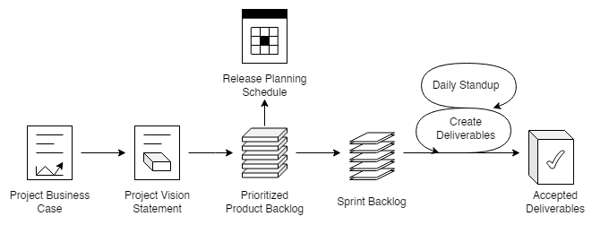
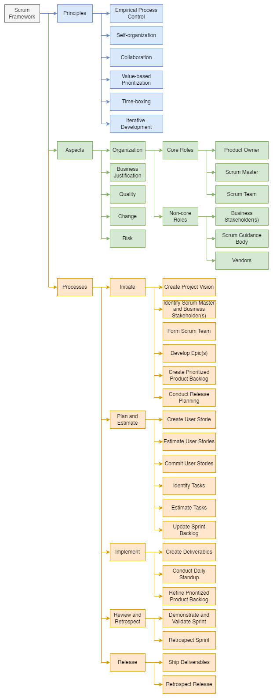

# Scrum Body of Knowledge

## Introduction

### Overview of Scrum

A Scrum project involves a collaborative effort to create a new product, service, or other results defined in the Project Vision Statement.

Projects are impacted by time, cost, scope, quality, resources, organizational capabilities, and other limitations that make it difficult to plan , execute, manage, and ultimately succeed.

Scrum

* is an adaptive, iterative, fast, flexible, and effective framework designed to deliver significant value quickly and throughout a project, and
* may also be used to manage the continuous maintenance of products and services, track issues, and manage changes.

A key strength of Scrum is its use of cross-functional, self-organized, and empowered teams who divide their
work into short, concentrated work cycles called Sprints.

|  |
| :----------------------------------------: |
| Figure 1 — Scrum flow for one Sprint |

The Scrum cycle begins with a Stakeholder Meeting , during which the Project Vision is created. The Product Owner then develops a Prioritized Product Backlog which contains a prioritized list of business and project requirements in the form of User Stories . Each Sprint begins with a Sprint Planning Meeting, during which high priority User Stories are considered for inclusion in the Sprint . A Sprint generally lasts one to four weeks and involves the Scrum Team working to create potentially shippable deliverables or product increments. During the Sprint, short, highly focused Daily Standup Meetings are conducted where team members discuss daily progress. The Product Owner can

* assess completed deliverables during the Sprint , and
* accept the deliverables that meet the predefined Acceptance Criteria.

Toward the end of the Sprint , a Sprint Review Meeting is held during which the Product Owner and relevant business stakeholders are provided a demonstration of the deliverables.
The Sprint cycle ends with a Retrospect Sprint Meeting where the team members discuss ways they can improve their work and performance as they move forward into the subsequent Sprint.

### Scrum vs. Waterfall PM

| Criterion | Scrum | Waterfall |
| :----------------------------- | :------------------------------------------- | :----------------------------------------- |
| Emphasis on | People | Processes |
| Documentation | Minimal - only as required | Comprehensive |
| Process style | Iterative | Linear |
| Upfront planning | Low | High |
| Prioritization of requirements | Base on business value and regularly updated | Fixed in the project plan |
| Quality Assurance | Customer centric | Process centric |
| Organization | Self-organized | Managed |
| Management style | Decentralized | Centralized |
| Change | Updates to Prioritized Product Backlog | Formal Change Management System |
| Leadership | Supporting | Command and control |
| Performance measurement | Business value | Plan conformity |
| Return on Investment | Early/throughout project life cycle | End of project life cycle |
| Customer involvement | High throughout the project | Varies depending on the project life cycle |

### Why Use Scrum?

Some of the key benefits of using Scrum in any project are:

| Benefit | Description |
| :---------------------------- | :----------------------------------------------------------------------------------------------------------------------------------------------------------------------------------- |
| Adaptability | Empirical process control and iterative delivery make projects adaptable and open to incorporating change |
| Transparency | All information radiators like a*Scrumboard* and *Sprint Burndown Chart* are shared, leading to an open work environment |
| Continuous Feedback | Continuous feedback is provided through the Conduct Daily Standup and Demonstrate and Validate Sprint processes |
| Continuous Improvement | The deliverables are improved progressively Sprint by Sprint , through the Refine Prioritized Product Backlog process |
| Continuous Value Delivery | Iterative processes enable the continuous delivery of value through the Ship Deliverables process as frequently as the customer requires |
| Sustainable Pace | Scrum processes are designed such that the people involved can work at a sustainable pace that they can, in theory, continue indefinitely |
| Early High Value Delivery | The Create Prioritized Product Backlog process ensures that the highest value requirements of the customer are satisfied first. |
| Efficient Development Process | Time-boxing and minimizing non-essential work leads to higher efficiency levels. |
| Motivation | The Conduct Daily Standup and Retrospect Sprint processes lead to greater levels of motivation among employees |
| Faster Problem Resolution | Collaboration and colocation of cross-functional teams lead to faster problem-solving |
| Effective Deliverables | The Create Prioritized Product Backlog process and regular reviews after creating deliverables ensure effective deliverables to the customer |
| Customer Centric | Emphasis on business value and having a collaborative approach to engage business stakeholders ensures a customer-oriented framework |
| High Trust Environment | Conduct Daily Standup and Retrospect Sprint processes promote transparency and collaboration, leading to a high-trust work environment ensuring low friction among employees |
| Collective Ownership | The Commit User Stories process allows team members to take ownership of the project and their work, leading to better quality |
| High Velocity | A collaborative framework enables highly skilled cross-functional teams to achieve their full potential and high velocity |
| Innovative Environment | The Retrospect Sprint and Retrospect Release processes create an environment of introspection, learning, and adaptability leading to an innovative and creative work environment |

#### Scalability

To be effective, Scrum Teams should ideally have 6 to 10 members.
This practice may be the reason for the misconception that the Scrum framework can only be applied to small projects.
However, the framework can easily be scaled for effective use in large projects, programs, and portfolios. In situations where the Scrum Team size exceeds ten people, multiple Scrum Teams can be formed to work on the project.

The logical approach of the guidelines and principles in this framework can be used to manage projects of any size, spanning geographies and organizations.
Large projects may have multiple Scrum Teams working in parallel, making it necessary to synchronize and facilitate the flow of information and enhance communication.
Large or complex projects are often implemented as a program or portfolio.

### Framework

The Scrum framework consists of three areas:

* principles,
* aspects, and
* processes.

|  |
| :----------------------------------------: |
| Figure 2 — Scrum framework |

#### Principles

Scrum principles are the core guidelines for applying the Scrum framework and should mandatorily be used in all Scrum projects.
The six Scrum principles presented are:

| Principle | Description |
| :------------------------- | :--------------------------------------------------------------------------------------------------------------------------------------------------------------------------------------------------------------------------------------- |
| Empirical Process Control | Aids learning through experimentation, especially when the problem is not well defined or when there are no clear solutions |
| Self-organization | Today’s workers deliver significantly greater value when self-organized, resulting in better team buy-in, shared ownership, and an innovative and creative environment that is more conducive to growth |
| Collaboration | Awareness, articulation, and appropriation. Project delivery is a shared value-creation process with teams working and interacting together, as well as with the customer and other business stakeholders, to deliver the greatest value |
| Value-based Prioritization | Focus on delivering maximum business value, from early in the project and continuing throughout |
| Time-boxing | Time is considered a limiting constraint in Scrum and is used to help effectively manage project planning and execution. |
| Iterative Development | How to better manage changes and build products that satisfy customer needs |

#### Aspects

* Organization

 * Core Roles
 * **Product Owner**: the person responsible for
 * achieving maximum business value for the project,
 * articulating customer requirements and maintaining business justification for the project.
 * **Scrum Master**: facilitator who
 * ensures that the Scrum Team is provided with an environment conducive to completing the project successfully,
 * guides, facilitates, and teaches Scrum practices to everyone involved in the project;
 * clears impediments for the team,
 * ensures that Scrum processes are being followed.
 * **Scrum Team**: group or team responsible for understanding the requirements specified by the Product Owner and creating the project deliverables.
 * Non-core Roles
 * **Business Stakeholder(s)**
 * **Scrum Guidance Body**
 * **Vendors**
* Business Justification

 * Proper business assessment before starting any project helps key decision makers understand the business need for a change or a new product or service, the justification for moving forward with a project, and its viability
 * It is impossible to guarantee project success at completion, irrespective of the size or complexity of a project $\rightarrow$ Considering this uncertainty of achieving success, Scrum attempts to start delivering results as early in the project as possible.
 * This early delivery of results, and thereby value, provides an opportunity for reinvestment and proves the worth of the project to interested business stakeholders.
* Quality

 * Quality is the ability of the completed product or deliverables to meet the Acceptance Criteria and achieve the business value expected by the customer.
 * To ensure a project meets quality requirements, Scrum adopts an approach of continuous improvement whereby
 the team learns from experience and stakeholder engagement to constantly keep the Prioritized Product Backlog 
 updated with any changes in requirements
 * The Prioritized Product Backlog is simply never complete until the closure or termination of the project
 * Any changes to the requirements reflect changes in the internal and external business environment and allow the team to continually work and adapt to achieve those requirements
* Change

 * Every project, regardless of its method or framework used, is exposed to change.
 * It is imperative that project team members understand that the Scrum development processes are designed to embrace change.
 * Organizations should try to maximize the benefits that arise from change and minimize any negative impacts
 through diligent change management processes by the principles of Scrum.
 * A primary principle of Scrum is its acknowledgment that
 * business stakeholders (e.g., customers, users, and sponsors) change their minds about what they want and need throughout a project (sometimes referred to as requirements churn), and
 * it is difficult, if not impossible, for business stakeholders to define all requirements during project initiation.
 * Scrum projects welcome change using short, iterative Sprints that incorporate customer feedback on each Sprint’s deliverables.
 * This enables the customer to regularly interact with the Scrum Team members, view deliverables as they are ready, and change requirements if needed earlier in the Sprint.
 * Also, the portfolio or program management teams can respond to Change Requests about Scrum projects
 applicable at their level.
* Risk

 * Risk is defined as an uncertain event or set of events that can affect the objectives of a project and may
 contribute to its success or failure.
 * Risks that are likely to positively impact the project are referred to as opportunities, whereas threats are risks that could affect the project negatively.
 * Managing risk must be done proactively, and it is an iterative process that should begin at project initiation and continue throughout the project’s lifecycle.
 * The process of managing risks should follow some standardized steps to ensure that risks are identified and evaluated and a proper course of action is determined and acted upon accordingly.
 * Risks should be identified, assessed, and responded to based on two factors — the probability of each risk’s occurrence and the possible impact in the event of such occurrence.
 * Risks with a high probability and impact value (determined by multiplying both factors) should be addressed before those with a relatively lower value.
 * In general, once a risk is identified, it is important to understand the risk with regards to the probable causes and the potential effects if the risk occurs.

#### Processes

| Phase | Fundamental Scrum Processes |
| --------------------- | -------------------------------------------------- |
| Initiate | Create Project Vision |
| | Identify Scrum Master and Business Stakeholder(s)) |
| | Form Scrum Team |
| | Develop Epic(s) |
| | Create Prioritized Product Backlog |
| | Conduct Release Planning |
| Plan and Estimate | Create User Stories |
| | Estimate User Stories |
| | Commit User Stories |
| | Identify Tasks |
| | Estimate Tasks |
| | Update Sprint Backlog |
| Implement | Create Deliverables |
| | Conduct Daily Standup |
| | Refine Prioritized Product Backlog |
| Review and Retrospect | Demonstrate and Validate Sprint |
| | Retrospect Sprint |
| Release | Ship Deliverables |
| | Retrospect Release |

##### Initiate

The processes relevant to the **Initiate** phase are as follows:

1. **Create Project Vision**
 * The project business case is reviewed to create a *Project Vision Statement* that will serve as the inspiration and provide a focus for the entire project
 * The Product Owner is identified
2. **Identify Scrum Master and Business Stakeholder(s)**: The Scrum Master and business stakeholders are identified using specific selection criteria.
3. **Form Scrum Team**: Scrum Team members are identified
4. **Develop Epic(s)**
 * The *Project Vision Statement* serves as the basis for developing Epics
 * *User Group Meetings* may be held to discuss appropriate Epics
5. **Create Prioritized Product Backlog**
 * Epic(s) are refined, elaborated, and then prioritized to create a Prioritized Product Backlog for the project.
 * The Done Criteria is also established
6. **Conduct Release Planning**
 * With support from the Scrum Team, the Product Owner develops a Release Planning Schedule , which is essentially a phased deployment schedule that can be shared with the project's business stakeholders.
 * Length of Sprint is also determined

##### Plan and Estimate

The processes relevant to the Plan and Estimate phase are as follows:

1. **Create User Stories**
 * User Stories and their related Acceptance Criteria are created by the Product Owner and incorporated into the Prioritized Product Backlog
 * User Stories are designed to ensure that the customer’s requirements are clearly depicted and can be fully understood by all business stakeholders
2. **Estimate User Stories**: the Scrum Team, supported by the Scrum Master, estimates the User Stories and identifies the effort required to develop the functionality described in each User Story 
3. **Commit User Stories**
 * The Scrum Team commits to delivering Product Owner-approved User Stories for a Sprint.
 * The results of this process are the committed
 * User Stories , and
 * Sprint Backlog 
4. **Identify Tasks**—In this process, the committed User Stories are broken down into specific tasks and compiled into a Task List
5. **Estimate Tasks**: The Scrum Core Team estimates the effort required to accomplish each task in the Task List 
6. **Update Sprint Backlog**; The Scrum Core Team updates the Sprint Backlog with further details about the tasks as part of the Sprint Planning Meeting

##### Implement

The processes relevant to the Implement phase are as follows:

1. **Create Deliverables**
 * The Scrum Team works on the tasks in the Sprint Backlog to create Sprint Deliverables
 * A Scrumboard is often used to track the work and activities
 * Issues or problems faced by the Scrum Team should be updated in an Impediment Log 
2. **Conduct Daily Standup**: every day, a highly focused, Time-boxed meeting, referred to as the Daily Standup Meeting , is conducted to update each other on their individual progress and any impediments they may be facing
3. **Refine Prioritized Product Backlog**
 * The Prioritized Product Backlog is continuously updated and maintained
 * A Prioritized Product Backlog Review Meeting is held, in which any changes or updates to the backlog are discussed and incorporated into the Prioritized Product Backlog as appropriate.

##### Review and Retrospect

The processes relevant to the Review and Retrospect phase are as follows:

1. **Demonstrate and Validate Sprint**
 * The Scrum Team demonstrates the Sprint deliverables to the Product Owner and relevant business stakeholders in a Sprint Review Meeting
 * The purpose of this meeting is to secure approval and acceptance of the Sprint User Stories by the Product Owner
2. **Retrospect Sprint**
 * The Scrum Master and Scrum Team meet to discuss the lessons learned throughout the Sprint 
 * This information is documented and should be applied to future Sprints.
 * Often, as a result of this discussion, there may be agreed-on actionable improvements or updated Scrum Guidance Body recommendations.

##### Release

The processes relevant to the Release phase are as follows:

1. **Ship Deliverables**
 * All deliverables from the accepted User Stories of previously completed Sprints are delivered or transitioned to the relevant business stakeholders
 * A formal Working Deliverables Agreement documents the successful completion of the release
2. **Retrospect Release**
 * Business stakeholders and Scrum Core Team members assemble to reflect on the release and identify, document and internalize the lessons learned.
 * Often, these lessons lead to the documentation of agreed actionable improvements to be implemented in future projects.
