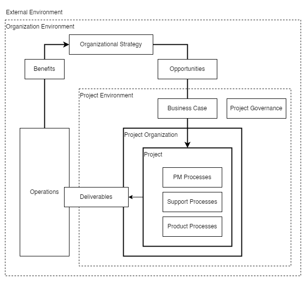
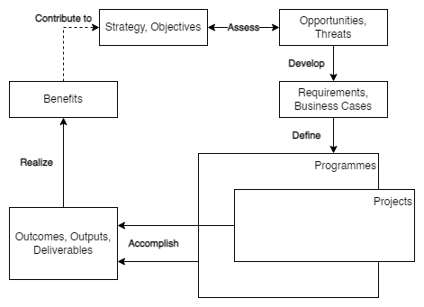
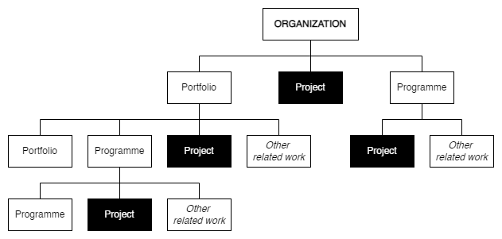
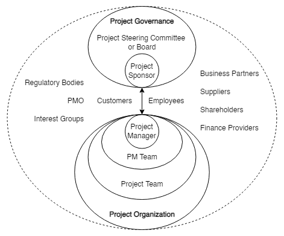

# PM Concepts
This page provides
* the key concepts applicable to most projects, and
* the environments in which projects are performed. 

Figure 1 shows how PM concepts relate to each other;
* the _organizational strategy_ identifies _opportunities_;
* _opportunities_ are evaluated and should be documented;
* selected opportunities are further developed in a _business case_ or other similar document and can result in one or more projects that provide _deliverables_;
* those _deliverables_ can be used to realize _benefits_,
* the _benefits_ can contribute to realizing and further developing the _organizational strategy_.

|
|:--:|
|Figure 1 — Example of value creation framework|

## Project
A project consists of a unique set of processes consisting of coordinated and controlled activities with start and end dates to achieve project objectives. \
Achievement of the project objectives requires providing deliverables conforming to specific requirements. \
A project may be subject to multiple constraints.

Although many projects may be similar, each project is unique. \
Project differences may occur in the following:
* deliverables provided;
* stakeholders influencing;
* resources used;
* constraints;
* the way processes are tailored to provide the deliverables.

Every project has a definite start and end and is usually divided into phases.

## Project Management
**Project management (PM)** is the application of methods, tools, techniques, and competencies to a project. \
PM includes the integration of the various phases of the project life cycle.

PM is performed through processes. \
The processes selected for performing a project should be aligned in a systemic view. 

Each phase of the project life cycle should have specific deliverables. \
These deliverables should be regularly reviewed during the project to meet the requirements of the sponsor, customers, and other stakeholders.

## Organizational Strategy and Projects
### Organizational Strategy
Organizations generally establish strategies based on their mission, vision, policies, and factors outside the organizational boundary. \
Projects are often the means to accomplish strategic goals. \
An example of a value creation framework is shown in Figure 2.
|
|:--:|
|Figure 2 — Example of value creation framework|

Strategic goals may guide the identification and development of opportunities. \
Opportunities selection includes consideration of various factors, such as how benefits can be realized and risks can be managed.

The project aims to provide measurable benefits that contribute to realizing the selected opportunities. \
The project objective contributes to the project goal by creating the required deliverables. 

Project goals are achieved when the benefits are realized. \
Goals might not be achieved until a time after the objectives are achieved.

### Opportunity Evaluation and Project Initiation
To support informed decision-making by responsible management, opportunities may be evaluated to identify feasible projects that could transform some or all of these opportunities into realized benefits. \
These opportunities 
* may address, for example, a new market demand, a current organizational need, or a new legal requirement, and
* are often evaluated through a set of activities that provide formal authorization to start a new project.

The organization should identify a project sponsor responsible for project goals and benefits. \
The goals and benefits may result in a justification for the investment in the project (e.g., in the form of a business case), which may contribute to prioritizing all opportunities. \
The purpose of the justification is usually to obtain organizational commitment and approval for investment in the selected projects.

The evaluation process may include multiple criteria, including financial investment appraisal techniques and qualitative criteria, such as strategic alignment, social impact, and environmental impact. \
Criteria may differ from one project to another.

### Benefits Realization
Benefits realization is generally the responsibility of organizational management, which may use the deliverables of the project to realize benefits in alignment with the organizational strategy. \
The project manager should consider the benefits and their realization as they influence decision-making throughout the project life cycle.

## Project Environment
### General
The project environment may impact project performance and success. \
The project team should consider the following:
* factors outside the organizational boundary, such as socio-economic, geographical, political, regulatory, technological, and ecological; 
* factors inside the organizational boundary include strategy, technology, project management maturity, resource availability, organizational culture, and structure.

### Factors Outside the Organizational Boundary
Factors outside the organizational boundary may impact the project by imposing constraints or introducing risks affecting the project. \
Although these factors are often beyond the project manager's control, they should still be considered.

|
|:--:|
|Figure 3 — Example of relationships between portfolios, programmes and projects|

### Factors Inside the Organizational Boundary
#### General
A project usually exists inside a larger organization encompassing other activities. \
In such cases, relationships exist between the project and its environment, business planning, and operations. 

Pre-project and post-project activities may include business case development, feasibility studies, and transition to operations. \
Projects may be organized within programmes and project portfolios. 

#### Programme Management
A **programme** is generally a group of related projects and other activities aligned with strategic goals. 

Programme management consists of centralized and coordinated activities to achieve the goals.

#### Project Portfolio Management
A **project portfolio** is generally a collection of projects and programmes and other work grouped to facilitate the effective management of that work to meet strategic goals. 

Project portfolio management (PPM) is generally the centralized management of one or more project portfolios, which includes identifying, prioritizing,
authorizing, directing, and controlling projects, programmes, and other work to achieve specific strategic goals.

It may be appropriate to conduct the opportunity identification and selection, as well as the approval and management of projects, through a project portfolio management system.

## Project Governance
**Governance** is the framework by which an organization is directed and controlled.

Project governance includes, but is not limited to, those areas of organizational governance specifically related to project activities. \
Project governance may include subjects such as the following:
* defining the management structure;
* the policies, processes, and methodologies to be used;
* limits of authority for decision-making;
* stakeholder responsibilities and accountabilities;
* interactions such as reporting and the escalation of issues or risks.

The responsibility for maintaining the appropriate governance of a project is usually assigned either to the project sponsor or to a project steering committee.

## Projects and Operations
PM fits within the general framework of management. 

PM differs from other management disciplines by the project's temporary and unique nature.

Organizations perform work to achieve specific goals. \
Generally, this work may be categorized as either 
* operations
  * performed by relatively stable teams through ongoing and repetitive processes,
  * focused on sustaining the organization;
* projects 
  * are performed by temporary teams, 
  * are non-repetitive, and 
  * provide unique deliverables.

## Stakeholders and Project Organization
The project stakeholders, including the project organization, should be described in sufficient detail for the project to be successful. 

The roles and responsibilities of stakeholders should be defined and communicated based on the organization and project goals. 

Stakeholder interfaces should be managed within the project through the PM processes.

The project organization is the temporary structure that includes project roles, responsibilities and levels of authority, and boundaries that must be defined and communicated to all project stakeholders. 
The project organization
* may depend on project stakeholders' legal, commercial, interdepartmental, or other arrangements.
* may include the following roles and responsibilities:
  1. the _project manager_, who leads and manages project activities and is accountable for project completion;
  2. the _PM team_, which supports the project manager in leading and managing the project activities;
  3. the _project team_, which performs project activities.

Project governance may involve the following:
* the _project sponsor_, who authorizes the project, makes executive decisions, and solves problems and conflicts beyond the project manager's authority;
* the _project steering committee_ or _board_ contributes to the project by providing senior-level guidance.

|
|:--:|
|Figure 4 — Example of potential project stakeholders|

Figure 4 includes the following additional stakeholders:
* customers or customer representatives who contribute to the project by specifying project requirements and accepting the project deliverables;
* suppliers, who contribute to the project by supplying resources to the project;
* the project management office (PMO) may perform various activities, including governance, standardization, PM training, project planning, and project monitoring.

## Competencies of Project Personnel
Project personnel should develop competencies in PM principles and processes to achieve project objectives and goals. \
Each project team requires competent individuals capable of applying their knowledge and experience to provide the project deliverables. 

Any identified gap between the available and required competence levels represented on the project team could introduce risk and should be addressed. 

PM competencies can be categorized into, but are not limited to, the following:
* technical competencies for delivering projects in a structured way, including the project management terminology, concepts, and processes defined in this International Standard;
* behavioral competencies associated with personal relationships inside the defined boundaries of the project;
* contextual competencies related to the management of the project inside the organizational and external environment.
Competency levels may be raised through professional development processes such as training, coaching, and mentoring inside or outside an organization.

## Project Life Cycle
Projects are usually organized into **phases** determined by governance and control needs. \
These phases should 
* follow a logical sequence, with a start and an end, and
* use resources to provide deliverables. 

To manage the project efficiently during the entire project life cycle, a set of activities should be performed in each phase. \
Project phases are collectively known as the **project life cycle**. \
The project life cycle spans the period from the start of the project to its end. 

The phases are divided by **decision points**, varying depending on the organizational environment. 
The decision points facilitate project governance. \
By the end of the last phase, the project should have provided all deliverables. \
To manage a project throughout its life cycle, PM processes should be used for the project as a whole or individual phase for each team or sub-project.

## Project Constraints
There are several types of constraints, and as constraints are often interdependent, a project manager needs to balance a particular constraint against the others. 
The project deliverables should fulfill the requirements for the project and relate to any given constraints such as 
* _scope_, 
* _quality_, 
* _schedule_, 
* _resources_, and 
* _cost_. 

Constraints are generally interrelated, so a change in one may affect one or more of the other constraints. \
Hence, the constraints may impact the decisions made within the PM processes. \
Achievement of consensus among key project stakeholders on the constraints may form a strong foundation for project success.
Some constraints could be the following:
* the duration or target date for the project;
* the availability of the project budget;
* the availability of project resources, such as people, facilities, equipment, materials, infrastructure, tools, and other resources required to carry out the project activities relating to the requirements of the project;
* factors related to health and safety of personnel;
* the level of acceptable risk exposure;
* the potential social or ecological impact of the project;
* laws, rules, and other legislative requirements.

## Relationship between PM Concepts and Processes
PM is accomplished through processes utilizing the concepts and competencies 

A **process** 
* is a set of interrelated activities;
* is categorized into three major types:
  * _PM_ processes
    * specific to PM,
    * determine how the activities selected for the project are managed;
  * _delivery_ processes
    * are not unique to PM, 
    * result in the specification and provision of a particular product, service, or result, 
    * which vary depending on the particular project deliverable;
  * _support_ processes
    * are not unique to PM,
    * provide relevant and valuable support to product and PM processes in logistics, finance, accounting, and safety disciplines.

Product, support, and PM processes might overlap and interact throughout a project.