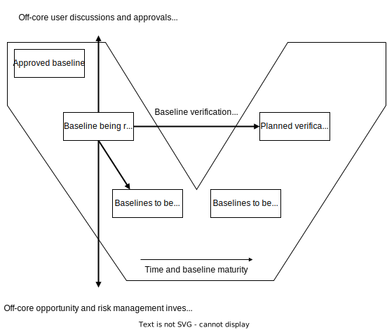
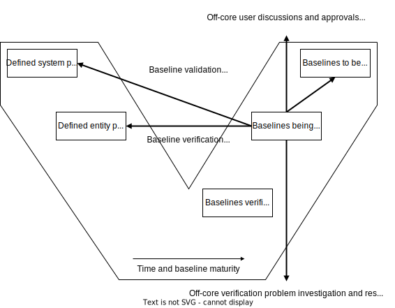
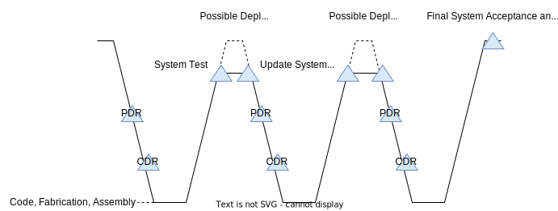
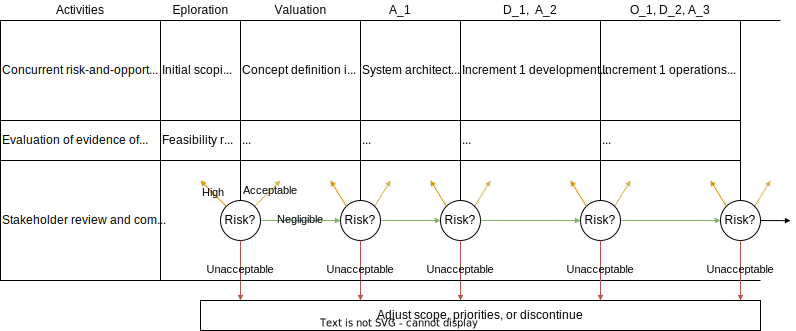

# SEBoK 2.9

Notes from Guide to the Systems Engineering Body of Knowledge (SEBok), version 2.9

## Part 3: Systems Engineering and Management (SE&M)

### Systems Engineering and Management

Systems Engineering and Management (SE&M) articles provide system lifecycle best practices for defining and executing interdisciplinary processes to ensure that customer needs are satisfied with a technical performance, schedule, and cost compliant solution.

### SE&M Knowledge Areas

The SE&M articles are organized into the following Knowledge Areas (KAs).

* Systems Engineering STEM Overview
* Model-Based Systems Engineering (MBSE)
* Systems Life Cycle Approaches
* System Life Cycle Models
* Systems Engineering Management
* Business and Mission Analysis
* Stakeholder Needs Definition
* System Architecture Definition
* Detailed Design Definition
* System Analysis
* System Realization
* System Implementation
* System Integration
* System Verification
* System Transition
* System Validation
* System Operation
* System Maintenance
* System Specialty Engineering
* Logistics
* Service Life Management
* Systems Engineering Standards

### Systems Engineering & Management Overview

The **role** of Systems Engineering (SE) is to define system, constraints, allocations, behavior and structure characteristics to satisfy customer needs.

The **system** is defined in terms of

* hierarchical structural elements, and
* their behavior interactions.

The **interactions** include the exchange of data, energy, force, or mass which modifies the state of the cooperating elements resulting in emergent, discrete, or continuous **behaviors**.

The **behaviors** are at sequential levels of aggregation (bottoms-up) or decomposition (top-down) to satisfy requirements, constraints, and allocations.

SE collaborates within an integrated product **team** with electrical, mechanical, software, and specialty engineering to define the subsystem and component detailed design implementations to develop a holistic technical solution.

### Model-Based Systems Engineering (MBSE)

Model-based Systems Engineering (MBSE)

* is a paradigm that uses formalized representations of systems, known as models, to support and facilitate the performance of SE tasks throughout a system’s life cycle.
* is frequently contrasted with legacy document-based approaches where systems engineering captures system design information via multiple independent documents in various non-standardized formats.
* consolidates of system information in system design models, which provide primary SE artifacts.

These system models, which are generally expressed in a standardized modelling language such as Systems Modeling Language (SysML®) express key system information in a concise, consistent, correct, and coherent format.

When implemented properly, MBSE models permit the standardized consolidation and integration of system knowledge across engineering disciplines and subsystems and streamline key systems engineering tasks while also minimizing developmental risk.

#### System Models

##### Definition of a model

Models

* are representations that are used to capture, analyze, and/or communicate information about a system or concept.
* can vary in scope, purpose, and type, and can be utilized both individually as stand-alone entities as well as in concert with each other as part of an integrated set.

##### Model Properties

A model can be described and classified with respect to the following properties:

* Scope
* Domain
* Formality
* Abstraction
* Physical/conceptual
* Descriptive/analytical
* Fidelity
* Completeness
* Integration
* Quality

##### Criteria for Effective MBSE Models

While a successful MBSE workflow can involve the use of several different interconnected or standalone models of various scopes and types based on user needs, the main system model in an MBSE projects generally should have
the following characteristics:

1. A scope which matches the scope of the project (i.e., it should encompass the entire SoI);
2. Representative of a holistic perspective from all relevant domains.
3. Strict compliance with a previously established standardized modeling language, whether that be an existing language such as SysML® or a custom formalism.
4. Fully abstracted, to only include relevant information appropriate for the SoI and its desired use-case(s).
5. Conceptual in nature, to permit the capture of intangible information (e.g., system requirements)
6. Containing a description of the system functional and structural architecture at minimum and supplemented by
   integrated analytical/quantitative property descriptions as needed.
7. Demonstrating sufficient fidelity to capture relevant system elements and behavior.
8. Fully complete given its scope.
9. Integrated with any necessary auxiliary models.
10. Sufficiently high-quality as to meet the needs of those designing, developing, or otherwise working on the system.
    In terms of content, effective system models are expected to capture key system information regarding requirements, system functionality/behavior, structure/form, properties, and interconnections between system components.

##### Digital Twins

When MBSE models of physical systems are built with sufficient completeness and fidelity, it is possible for them to function as "digital twins" of the systems they represent.

Digital twins provide a means of accurately representing a system’s form and function throughout the system’s lifecycle, all within a digital environment.

Creating such digital twins allow

* testing, analysis, and optimization of systems in a virtual environment at
  * no risk to the actual system of interest, and
  * a greatly reduced cost/burden.
* representing the behavior of systems under conditions which would be impractical or impossible to induce under experimental conditions, thereby making it possible to obtain information not obtainable via study of the original physical system.

## Knowledge Area: Systems Lifecycle Approaches

### Systems Lifecycle Approaches

Key principles:

* life cycle,
* life cycle model, and
* life cycle processes.

A generic SE paradigm is described; this forms a starting point for discussions of more detailed life cycle knowledge.

#### Topics

This KA contains the following topics:

* Generic Life Cycle Model
* Applying Life Cycle Processes
* Life Cycle Processes and Enterprise Need

#### Life Cycle Terminology

The term "life cycle" is used to describe

* the complete life of an instance of a system-of-interest (SoI), and
* the managed combination of multiple such instances to provide capabilities which deliver stakeholder satisfaction.

A life cycle model:

* identifies the major stages that a specific SoI goes through, from its inception to its retirement.
* is generally implemented in development projects and are strongly aligned with management planning and decision making.

#### Generic Systems Engineering Paradigm

Overall goals of any SE effort:

* understanding of stakeholder value,
* selection of a specific need to be addressed,
* transformation of that need into a system (the product or service that provides for the need), and
* use of that product or service to provide the stakeholder value.

SoI's identified in the formation of a System Breakdown Structure (SBS).
SoI 1 is broken down into its basic elements, which in this case are systems as well (SoI 2 and SoI 3).
These two systems are composed of system elements that are not refined any further.

### Generic Life Cycle Model

Each SoI has an associated LC model.

The generic LC model below applies to a single SoI.

SE must generally be synchronized across a number of tailored instances of such LC models to fully satisfy stakeholder needs.

|  |
| :----------------------------------: |
|      System Breakdown Structure      |

|  |
| :----------------------------------------: |
|              SoI LC/Processes              |

#### A Generic System Life Cycle Model

There is no single "one-size-fits-all" system LC model that can provide specific guidance for all project situations.

The model is defined as a set of stages, within which technical and management
activities are performed.

The stages are terminated by decision gates, where the key stakeholders decide whether

* to proceed into the next stage,
* to remain in the current stage, or
* to terminate or re-scope related projects.

Stages:

1. Definition
   * Concept Definition
   * System Definition
2. System Realization
3. System Production, Support, and Utilization (PSU)
   * System Production
   * System Support
   * System Utilization
4. System Retirement

### Applying Life Cycle Processes

The Generic Life Cycle Model describes a set of life cycle stages and their relationships.

In defining this we described some of the technical and management activities critical to the success of each stage.

While this association of activity to stage is important, we must also recognize the through life relationships between these activities to ensure we take a systems approach.

SE technical and management activities are defined in a set of life cycle processes.

These group together closely related activities and allow us to describe the relationships between them.

In this topic, we discuss a number of views on the nature of the inter-relationships between process activities within a life cycle model.

In general, the technical and management activities are applied in accordance with the principles of concurrency, iteration and recursion described in the generic systems engineering paradigm.

These principles overlap to some extent and can be seen as related views of the same fundamental need to ensure we can take a holistic systems approach, while allowing for some structuring and sequence of our activities.

The views presented below should be seen as examples of the ways in which different SE authors present these overlapping ideas.

#### Life Cycle Process Terminology

##### Process

* Is a series of actions or steps taken in order to achieve a particular end, and
* Can be performed by humans or machines transforming inputs into outputs.
* Are interpreted in several ways, including
  * technical,
  * LC,
  * business, or
  * manufacturing flow processes.

##### Requirement

* Are something that are needed/wanted but may not be compulsory in all circumstances,
* May refer to product/process characteristics/constraints.
* Different understandings of requirements are dependent upon
  * process state,
  * level of abstraction,
  * and type (e.g. functional, performance, constraint).
* May have multiple interpretations over time.
* Exist at multiple levels of enterprise/systems with multiple levels of abstraction, ranging from
  * highest level of the enterprise capability/customer need to
  * lowest level of the system design.
* Need to be defined at the appropriate level of detail for the level of the entity to which they apply.

##### Architecture

* Organizational structure of a system, whereby the system can be defined in different contexts.
* Is the art or practice of designing the structures.
* Can apply for a system product, enterprise, or service.
* Closely related to framework, as they are ways of representing architectures.

#### Life Cycle Process Concurrency

In the Generic LC Model, the execution of process activities is not compartmentalized to particular LC stages.

|  |
| :----------------------------------: |
|               RUP Hump               |

The lines on this diagram represent the amount of activity for each process over the generic life cycle.
The peaks (or humps) of activity represent the periods when a process activity becomes the main focus of a stage.
The activity before and after these peaks may represent through life issues raised by a process focus, e.g. how likely maintenance
constraints will be represented in the system requirements.
These considerations help maintain a more holistic perspective in each stage, or they can represent forward planning to ensure the resources needed to complete future activities have been included in estimates and plans, e.g. all resources needed for verification are in place or available.
Ensuring this hump diagram principle is implemented in a way which is achievable, affordable and appropriate to the situation is a critical driver for all life cycle models.

#### Life Cycle Process Iteration

The concept of iteration applies to LC stages within a LC model, and also applies to processes.

|  |
| :--------------------------------------------------------------------: |
|           Concept and System Definition processes iterations           |

Figure 3 below gives an example of the iteration between the other life cycle processes.
The iterations in this example relate to the overlaps in process outcomes shown in Figure 1.
They either allow consideration of cross process issues to influence the system definition (e.g. considering likely integration or verification approaches might make us think about failure modes or add data collection or monitoring elements into the system) or they allow risk management and through life planning activities to identify the need for future activities.

|  |
| :------------------------------------------------------------------------: |
| Concept and System Definition processes iterations --- System realization |

#### Life Cycle Process Recursion

The comprehensive definition of a SoI is generally achieved using decomposition layers and system elements.

Figure 4 presents a fundamental schema of a SBS.
The comprehensive definition of a SoI is generally achieved using decomposition layers and system elements.
In each decomposition layer and for each system, the System Definition processes are applied recursively because the notion of "system" is in itself recursive; the notions of SoI, system, and system element are based on the same
concepts (see Part 2).

|  |
| :----------------------------------------------------------------------------------------: |
|              Concept and System Definition processes iterations --- Recursion              |

#### Systems Approach to Solution Synthesis

##### Top-Down Approach: From Problem to Solution

In a **top-down** approach, concept definition activities

* are focused primarily on understanding
  * the problem,
  * the operational needs/requirements within the problem space, and
  * the conditions that constrain the solution and bound the solution space.
* determine
  * the mission context,
  * the mission analysis, and
  * te needs to be fulfilled in that context by a new or modified system (i.e. the SoI), and
* address stakeholder needs and requirements.
* consider functional, behavioral, temporal, and physical aspects of one or more solutions based on the results of concept definition.

System analysis:

* considers the advantages and disadvantages of the proposed system solutions both in terms of
  * how they satisfy the needs established in concept definition, as well as
  * the relative cost, time scales and other development issues.
* requires further refinement of the concept definition to ensure all legacy relationships and stakeholders relevant to a particular solution architecture have been considered in the stakeholder requirements.

The outcomes of this iteration between *Concept Definition* and *System Definition* define

* a required system solution and
* its associated problem context, which are used for
  * *System Realization*,
  * *System Deployment and Use*, and
  * *Product and Service Life Management* of one or more solution implementations.

In this approach, problem understanding and solution selection activities are

* completed in the front-end portion of system development and design and then
* maintained and refined as necessary throughout the LC of any resulting solution systems.

Depending upon the LC model, **top-down** activities can be

* sequential,
* iterative,
* recursive, or
* evolutionary.

##### Bottom-Up Approach: Evolution of the Solution

In some situations, the concept definition activities

* determine the need to evolve existing capabilities or
* add new capabilities to an existing system.

During the concept definition, the alternatives to address the needs are evaluated.

Engineers are then led to reconsider the system definition in order to modify or adapt some structural, functional, behavioral, or temporal properties during the product or service life cycle for a changing context of use or for the purpose of improving existing solutions.

Reverse engineering is often necessary to

* enable system engineers to (re)characterize the properties of the
  system-of-interest (SoI) or its elements.
* ensure that system engineers understand the SoI before beginning modification.

A **bottom-up** approach is necessary for

* analysis purposes, or
* (re)using existing elements in the design architecture.

Changes in the context of use or a need for improvement can prompt this.
In contrast, a **top-down** approach is generally used to define an initial design solution corresponding to a problem or a set of needs.

##### Solution Synthesis

In most real problems, a combination of **bottom-up** and **top-down** approaches provides the right mixture of innovative solution thinking driven by need, and constrained and pragmatic thinking driven by what already exists.

This is often referred to as a "middle-out" approach.

As well as being the most pragmatic approach, synthesis has the potential to

* keep the life cycle focused on whole system issues, and
* allow the exploration of the focused levels of detail needed to describe realizable solutions.

## Knowledge Area: System Life Cycle Models

### Categories of Life Cycle Model

Categories of potential LC process models:

* Pre-specified
  * single-step
  * multi-step
* Evolutionary
  * sequential
  * opportunistic
  * concurrent
* Interpersonal and emergent

The emergence of integrated, interactive hardware-software systems made pre-specified processes potentially harmful, as the most effective human-system interfaces tended to emerge with its use.
This led to the introduction of more lean approaches to concurrent hardware-software-human factors approaches such as:

* concurrent vee models, and
* Incremental Commitment Spiral Model.

## System Lifecycle Process Drivers and Choices

LC processes:

* impacted by many organizational factors,
* impact all other aspects of system design and development.

### Fixed-Requirements and Evolutionary Development Processes

Aside from the traditional, pre-specified, sequential, single-step development process (identified as Fixed Requirements), there are several models of evolutionary development processes; however, there is no one-size-fits-all approach that is best for all situations.

For rapid-fielding situations, an easiest-first, prototyping approach may be most appropriate.
For enduring systems, an easiest-first approach may produce an unscalable system, in which the architecture is incapable of achieving high levels of performance, safety, or security.

In general, system evolution now requires

* much higher sustained levels of SE effort,
* earlier and continuous integration and testing,
* proactive approaches to address sources of system change,
* greater levels of concurrent engineering, and
* achievement reviews based on evidence of feasibility versus plans and system descriptions.

Evolutionary development processes or methods have been in use since the 1960s (and perhaps earlier).

They allow a project to provide an initial capability followed by successive deliveries to reach the desired SoI.

This practice is particularly valuable in cases in which

* rapid exploration and implementation of part of the system is desired,
* requirements are unclear from the beginning, or are rapidly changing,
* funding is constrained,
* the customer wishes to hold the SoI open to the possibility of inserting new technology when it becomes mature, and
* experimentation is required to develop successive versions.

In evolutionary development a capability of the product is developed in an increment of time.
Each cycle of the increment subsumes the system elements of the previous increment and adds new capabilities to the evolving product to create an expanded version of the product in development.
This evolutionary development process, that uses increments, can provide a number of advantages, including:

* continuous integration, verification, and validation of the evolving product,
* frequent demonstrations of progress,
* early detection of defects,
* early warning of process problems, and
* systematic incorporation of the inevitable rework that may occur.

### Primary Models of Incremental and Evolutionary Development

|  |
| :----------------------------------------------------------------------------------: |
|              Primary models of incremental and evolutionary development              |

| Type          | Subtype       | Pros                                                                                           | Cons                                                                                    | Examples                                                                    |
| ------------- | ------------- | ---------------------------------------------------------------------------------------------- | --------------------------------------------------------------------------------------- | --------------------------------------------------------------------------- |
| Pre-specified | Single-step   | Efficient Easy to verify                                                                  | Difficulties with rapid change Emerging requirements                               | Simple manufactured products                                                |
|               | Multi-step    | Early initial capability Scalability when stable human-intensive systems                 | Emergent requirements or rapid change Architecture breakers                        | Vehicle platform plus value-adding pre-planned product improvements (PPPIs) |
| Evolutionary  | Sequential    | Adaptability to change Smaller human-intensive systems                                    | Easiest-first Late Costly fixes SE time gaps Slow for large systems | Small: Agile Larger: Rapid fielding                                    |
|               | Opportunistic | Mature technology upgrades                                                                     | Emergent requirements or rapid change SySE time gaps                               | Stable development Maturing technology                                 |
|               | Concurrent    | Emergent requirements or rapid change Stable development increments SysE continuity | Overkill on small or highly stable systems                                              | Rapid, emergent development Systems of systems                         |

### Incremental and Evolutionary Development Decision Table

| Type          | Subtype       | Stable, pre-specific  requirements? | Ok to wait for full system to be developed? | Need to wait for next-increment priorities? | Need to wait for next-increment enablers? |
| ------------- | ------------- | ---------------------------------------- | ------------------------------------------------ | ------------------------------------------------ | ---------------------------------------------- |
| Pre-specified | Single-step   | True                                     | True                                             |                                                  |                                                |
|               | Multi-step    | True                                     | False                                            |                                                  |                                                |
| Evolutionary  | Sequential    | False                                    | False                                            | True                                             |                                                |
|               | Opportunistic | False                                    | False                                            | False                                            | True                                           |
|               | Concurrent    | False                                    | False                                            | False                                            | False                                          |

## Evolutionary Sequential SLC Model: Vee

|  |
| :--------------------------------------------: |
|     Left Side of the Sequential Vee Model     |

|  |
| :----------------------------------------: |
| Stages, Purposes, and Major Decision Gates |

|  |
| :----------------------------------------------------: |
|                  Vee Activity Diagram                  |

|  |
| :----------------------------------------------: |
|      Right Side of the Sequential Vee Model      |

## Evolutionary Incremental SLC Models

### Evolutionary Approach

|  |
| :----------------------------------------------------------------------------: |
|                             Evolutionary Approach                             |

### Incremental Approach

<!-- |  |
| :------------------------------------: |
| Incremental Approach  | -->

### Evolutionary Concurrent LC Model: Incremental Commitment Spiral

Each spiral addresses requirements and solutions concurrently, rather than sequentially, as well as

* products and processes,
* hardware,
* software,
* human factors aspects, and
* business case analyses of alternative product configurations/product line investments.

Stakeholders

* consider the risks and risk mitigation plans, and
* decide on a course of action.

If the risks are acceptable and covered by risk mitigation plans, the project proceeds into the next spiral.

The development spirals after the first development commitment review follow the three-team incremental
development approach for achieving both agility and assurance.

|  |
| :------------------------------------------------------------------------------: |
|      Phased View of the Generic Incremental Commitment Spiral Model Process      |

### Agile and Lean Processes

Agile development methods can be used to support iterative LC models, allowing flexibility over a linear process that better aligns with the planned LC for a system.

Lean processes are often associated with agile methods, although they are more scalable and applicable to
high-assurance systems.

#### Scrum

#### Architected Agile Methods

Over the last decade, several organizations have been able to scale up agile methods by using two layers of
ten-person Scrum teams.

This involves, among other things, having each Scrum team’s daily meeting followed up by a daily meeting of the Scrum team leaders discussing up-front investments in evolving system architecture (Boehm
et al. 2010).

|  |
| :--------------------------------------------------------------: |
|                    Architected Agile Process                    |

## System Life Cycle Process Models: Agile Systems Engineering

A system LC starts at the concept definition phase, moves through stages until completion of this system, as defined in the concept definition stage.

A model representation of the LC may be

* physical,
* data, or
* graphic.

The process describes the steps to accomplish each stage of the LC including input to and output from this stage.

Today’s complex and increasingly highly connected systems face rapid obsolescence under the stress of technological change, environmental change, and rapidly evolving mission needs.
For these systems to remain robust against disruption they must be architected to agilely adapt.
To meet these needs, the system must be assessed to apply the process that best serves the system, subsystem or component of the SoI.

It is important to determine the best LC to use for the SoI early in the concept definition phase.

On a program that is going to operate agilely, especially if it will be a hybrid model with agile, and other LC models it is
important to define and harmonize them at key integration points based on

* hardware or
* other long-lead item maturity.

In the Agile SE process, the systems engineer works in an iterative, incremental manner, continually modeling, analyzing, developing, and trading options to bring the definition of the system solution into focus.

An example of this work will be analyzing and maintaining

* the requirements,
* the architectural model of the higher-level requirements, and
* linkage from those high-level requirements to the analyzed lower-level requirements.
* the interfaces are defined and followed as the development progresses

### Frameworks

The Agile SE process steps that are performed in each of the stages often include:

1. Define the highest priority and/or highest risk item while keeping design options open.
2. Design the solutions to meet those requirements, develop their products, perform tests, and demonstrate that product.
3. For large products in development where multiple teams integrate their work items together to show a demonstratable product, several iterations may be needed to get to that point.
4. Prior to starting an increment, all teams working to produce demonstrable products, should meet to plan their work, identify dependencies between the teams and establish commitments to meet the plan.
5. Release product to stakeholders and plan the next increment of work.

This Agile SE Framework aligns with the Scaled Agile Framework (SAFe) depiction of

* teams working program and
* team backlogs using iterative development.

SAFe

* is a framework that implements the principles of iterative development,
* represents how a large system may have multiple LC processes being followed in parallel over time
* key decision points need to be aligned between the multiple LC processes.

There are many agile approaches that a program could use as is or combined to adapt to what works best for a given domain.

For a complex system with changing requirements the assessment may result in the decision to use an incremental,
iterative approach for development.

Regardless of which model or framework is selected a program starts with a vision, a budget and usually a period of performance. Then the program’s stakeholders identify the highest value capability to develop first
The list of capabilities is prioritized so that the long-term development is visible.
However, this prioritized order may change as work progresses.
What is known about the intended product may have well defined requirements and architecture representations and what is conceptual will have those requirements and designs developed incrementally as time progresses.

This incremental method of development is enabled by the use of

* an open system architecture,
* MBSE tools,
* Set-based design,
* design thinking,
* continuous integration,
* continuous development,
* architecture patterns,
* microservice architecture, and
* Lean sengineering.

## Knowledge Area: Systems Engineering Management

### Systems Engineering Management

#### Discussion

* Single
  * SE
    * Needs and Opportunities Analysis
    * Operational Concept Development
    * System Scoping and Requiremens Definition
    * Architecture Definition
    * Trade-off Analysis, Modeling, and Simulation
  * P/SM
    * Staffing, Organizing, Directing
    * Cost, Schedule, Performance, Risk Monitoring and Control
    * Operations Planning and Presentation
    * Operations Management
  * SI
    * Production Line Preparation
    * Production
    * Production Control
    * Testing
* Double
  * SE + P/SM
    * Business Case Analysis
    * Systems Engineering Management
  * SE + SI
    * Production Planning and Analysis
    * System Integration
  * P/SM + SI
    * Supply Chain Management
    * Systems Implementation Management
* Triple
  * SE + SI + P/SM
    * Life Cycle Planning and Estimating
    * Change Analysis and Management
    * Q&A, V&V, Continuous Process Improvement

## Knowledge Area: Systems Engineering and Industrial Engineering

### Systems Engineering

> A transdisciplinary and integrative approach to enable the successful realization, use, and retirement of engineered systems, using systems principles and concepts, and scientific, technological, and management methods.

### Industrial Engineering

### Venn Diagram Comparison

SE

* Business/Mission Analysis
* Stakeholder Needs & Requirements
* System Requirements
* System Architecture (Logical and Physical)
* Systems Design and Engineering
* Systems Analysis
* Implementation
* Systems Integration
* Systems Verification
* Systems Validation
* System Operation

IE

* Work Design  Measurement
* Engineering Economics
* Facilities Engineering & Management
* Operations Engineering & Management
* Supply Chain Management
* Safety
* Design & Manufacturing Engineering

SE + IE

* OR & Analysis
* Quality & Reliability Engineering
* Ergonomics & Human Factors
* Engineering Management
* Information Engineering
* Product Design & Development
* Systems Deployment
* Updates, Upgrades, Modernization
* Service Life Extension
* System Maintenance
* Logistics
* Disposal & Retirement

### Roles in a System Life Cycle

| Stage | Stage                 | Role                  | Process                                                               |
| ----- | --------------------- | --------------------- | --------------------------------------------------------------------- |
| 1     | Establish System Need | SE                    |                                                                       |
| 2     | Design and Develop    | DE SE            | Design Test and Evaluation                                       |
| 3     | Produce System        | IE                    | Supply Chain Management Develop Processes Improve Processes |
| 4     | Deploy System         | IE                    | Transportation Training                                          |
| 5     | Operate System        | SE IE SE/DE | Reliability Growth Maintenance System Upgrades              |
| 6     | Retire System         | IE/SE                 |                                                                       |

## Knowledge Area: Systems Engineering and Project Management

### Relationships between Systems Engineering and Project Management

#### Overlap

There is a great deal of significant overlap between the scope of SE and other resources and the scope of PM.

These sources describe the importance of 
* understanding the scope of the work at hand, 
* how to plan for critical activities, 
* how to manage efforts while reducing risk, and 
* how to successfully deliver value to a customer.

The SE working on a project will plan, monitor, confront risk, and deliver the technical aspects of the project, while the PM is concerned with the same kinds of activities for the overall project.

#### Defining Roles and Responsibilities

Regardless of how the roles are divided up on a given project, the best way to reduce confusion is to explicitly describe the roles and responsibilities of the PM and the SE, as well as other key team members.

The Project Management Plan (PMP) and the Systems Engineering Management Plan (SEMP) are key documents used to define the processes and methodologies the project will employ to build and deliver a product or
service.

The PMP 
* is the master planning document for the project,
* describes all activities, including technical activities, to be integrated and controlled during the life of the program.

The SEMP 
* is the master planning document for the
systems engineering technical elements
* defines SE processes and methodologies used on the project and the relationship of SE activities to other project activities
* must be consistent with and evolve in concert with
the PMP
* integrate technical management plans and expectations  with customer plans and activities.

## The Influence of Project Structure and Governance on Systems Engineering and Project Management Relationships

### An Overview of Project Structures

PM and SE governance are dependent on the organization's structure.

For some projects, SE is subordinated to PM and in other cases, PM provides support to SE.

Projects
* exist within the structural model of an organization.
* are one-time, transient events that are 
  * initiated to accomplish a specific purpose and 
  * terminated when the project objectives are achieved.

Project size:
* On small projects, the same person accomplishes the work activities of both PM and SE.
Because the natures of the work activities are significantly different, it is sometimes more effective to have two persons performing PM and SE, each on a part-time basis.
* On larger projects there are typically too many tasks to be accomplished for one person to accomplish all of the necessary
work.
* On very large projects, PM and SE offices with a designated project manager and a designated lead systems engineer

Projects are typically organized in one of three ways: 
1. by functional structure, 
2. by project structure, and 
3. by a matrix structure.

In a function-structured organization, workers are grouped by the functions they perform. The systems engineering
functions can be: 
1. distributed among some of the functional organizations, 
2. centralized within one organization, or 
3. a hybrid, with some of the functions being distributed to the projects, some centralized and some distributed to functional organization.

|  |
| :--------------------------------------------------------------: |
|                    Organizational Continuum                    |

### Schedule-Driven versus Requirements-Driven Influences on Structure and Governance

This article addresses the influences on governance relationships between the project manager and the systems
engineer.

One factor that establishes this relationship is whether a project is schedule-driven or requirements-driven.

In general, 
* a project manager is responsible for delivering an acceptable product/service on the specified delivery date and within the constraints of the specified schedule, budget, resources, and technology.
* the systems engineer is responsible for 
  * collecting and defining the operational requirements,
  * specifying the systems requirements, 
  * developing the system design, 
  * coordinating component development teams, 
  * integrating the system components as they become available, 
  * verifying that the system to be delivered is correct, complete and consistent to its technical specification, and 
  * validating the operation of the system in its intended environment.

From a governance perspective, 
* the project manager is often thought of as being a movie producer who is responsible for balancing the schedule, budget, and resource constraints to meet customer satisfaction
* the systems engineer is responsible for product content; ergo, the systems engineer is analogous to a movie director.

Organizational structures, discussed previously, provide the project manager and systems engineer with different
levels of governance authority.

In addition, schedule and requirements constraints can influence governance
relationships.
* A schedule-driven project 
  * is one for which meeting the project schedule is more important than satisfying all of the project requirements; in these cases lower priority requirements may not be implemented in order to meet the schedule.
  * examples:
    * a project that has an external customer with a contractual delivery date and an escalating late delivery penalty, and
    * a project for which delivery of the system must meet a major milestone (e.g. a project for an announced product release of a cell phone that is driven by market considerations).
* For schedule-driven projects, 
  * the project manager is responsible for planning and coordinating the work activities and resources for the project so that the team can accomplish the work in a coordinated manner to meet the schedule.
  * the systems engineer works with the project manager to determine the technical approach that will meet the schedule. 
  * An Integrated Master Schedule (IMS) is often used to coordinate the project.
  * Examples:
    * exploratory development of a new system that is needed to mitigate a potential threat (e.g. military research
project) and
    * projects that must conform to government regulations in order for the delivered system to be safely operated (e.g.,
aviation and medical device regulations).

An Integrated Master Plan is often used to coordinate event-driven projects.

To satisfy the product requirements, the systems engineer is responsible for making technical decisions and making
the appropriate technical trades.
When the trade space includes cost, schedule, or resources, the systems engineer
interacts with the project manager who is responsible for providing the resources and facilities needed to implement
a system that satisfies the technical requirements.
Management structure:
* Schedule-driven projects are more likely to have a management structure in which the project manager plays the
central role
* Requirement-driven projects are more likely to have a management structure in which the systems engineer plays the central role