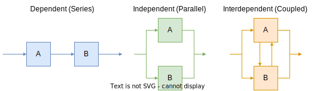
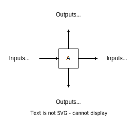
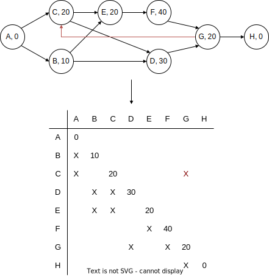
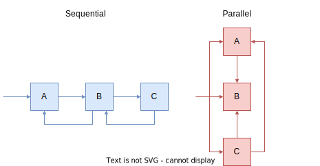
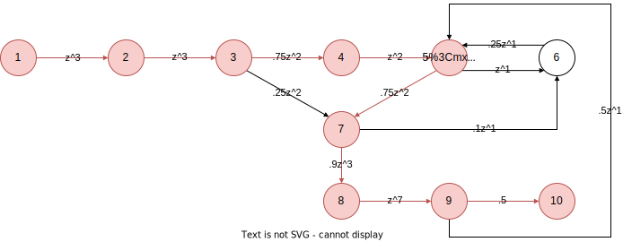
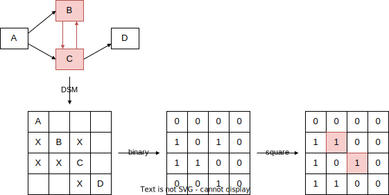

# Design Structure Matrix (DSM)

## Sequencing Tasks

|  |
| :--------------------------------------------: |
|            Task possible sequences            |

## DSMs

Types:

* Object-based
* Team-based
* Parameter-based
* Task-based

### Task-based DSMs

|  |
| :------------------------------------------: |
|              DSM Task Notation              |

|  |
| :--------------------------------------------------: |
|                  DSM Task Notation                  |

#### Sequencing/Partitioning

Sequencing = reordering of the DSM rows and columns such that the new DSM arrangement does not contain any feedback marks, thus transforming the DSM into an upper triangular form.

|  |
| :----------------------------------------------------------------------: |
|                       DSM Sequencing/Partitioning                       |

#### Tearing

Tearing = choosing the set of feedback marks that, if removed from the matrix (and then the matrix is re-partitioned), will render the matrix upper-triangular

Criteria when making tearing decisions:

* Minimal number of tears: the motivation behind this criterion is that tears represent an approximation or an initial guess to be used; we would rather reduce the number of these guesses used.
* Confine tears to the smallest blocks along the diagonal: the motivation behind this criterion is that if there are to be iterations within iterations (i.e. blocks within blocks), these inner iterations are done more often. Therefore, it is desirable to confine the inner iterations to a small number of tasks.

|  |
| :------------------------------------------------------------------------------------------------------------: |
|                                                  DSM Tearing                                                  |

### How to Create a Task-Based Design Structure Matrix Model

1. Select a project to model.
2. Identify the tasks of the project, who is responsible for each one, and the outputs created by each task.
3. Lay out the square matrix with the tasks in the order they are nominally executed.
4. Ask the process (task) experts what inputs are used for each task.
5. Insert marks representing the information inputs to each task.
6. Optional: Analyze the DSM model by re-sequencing the tasks to suggest a new process.
7. Identify coupled tasks representing the planned iterations. We call these the **meta-tasks**.
8. Identify groups of parallel (uncoupled) tasks.
9. Highlight the unplanned iterations.

## Iterations

Iterations = repetition of tasks due to:

* changes in input information (upstream),
* update of shared assumptions (concurrent), or
* discovery of errors (downstream).

### Types

| Type      | Cause                                  | Predictable               | Aim         |
| --------- | -------------------------------------- | ------------------------- | ----------- |
| Planned   | Needs to "get it right the first time" | Yes (when), No (how much) | Facilitated |
| Unplanned | Errors/unforseen problems              | No                        | Minimized   |

### Styles

| Style      | #Activities | Assumption                                  | Model               |
| ---------- | ----------- | ------------------------------------------- | ------------------- |
| Sequential | =1          | Next action $\leftarrow$ Probabilities     | Signal Flow Graph   |
| Parallel   | >=2         | Rework created for other coupled activities | Work Transformation |

|  |
| :------------------------------------------: |
|              Iteration Styles              |

#### Signal Flow Graph Model

A $- pz^t \rightarrow $ B 
where
* $p$ = probability
* $z^t$ = duration

|  |
| :------------------------------------------: |
|              Signal Flow Graph Model              |

#### Work Transformation Model

#### Assumptions

* All coupled tasks are attempted simultaneously.
* Off-diagonal elements correspond to fractions of each task’s work which must be repeated during subsequent iterations.
* Objective is to characterize the nature of design iteration.

#### Mathematics

| Math | Name |
| -- | --| 
| $u_{t+1} = A u_t$|Work vector|
| $U = \sum_{t=0}^\infty u_t = (\sum_{t=0}^\infty A^t)u_0$|Total work vector|
| $A= S \land S^{-1}$ |Eigenvalue decomposition|
|$U=S(\sum_{t=0}^\infty \land^t)S^{-1}u_0$|Substitution|
|$\sum_{t=0}^\infty \land^t = (I-\land)^{-1}$|Diagonal matrix of $1/(1-\lambda)$ terms|
|$U=S[(I-\land)^{-1}S^{-1}u_0]$|Total work is a scaling of the eigenvectors| 
where
* $U$ = total work
* $S$ = eigenvector matrix
* $[(I-\land)^{-1}S^{-1}u_0]$ = scaling vector

### Discover Loops

1. Replace X $\rightarrow$ 1 and "" $\rightarrow$ 0
2. Square binary matrix
3. Find non-zero diagonals

|  |
| :------------------------------------------: |
|              Find Loop Process              |