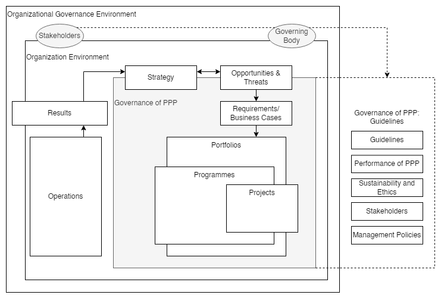
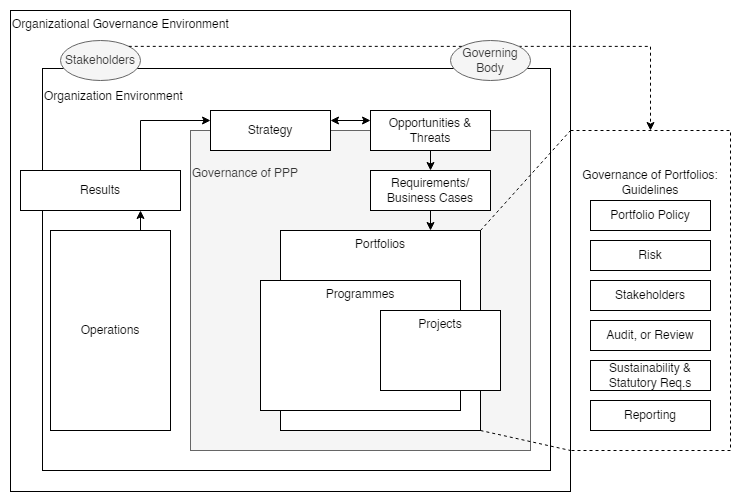

# Project Portfolio Management
## Context
### Organizational Governance
**Organizational governance** directs a permanent or temporary organization by establishing the governance framework. \
Governing bodies, executives, and senior management govern their organization to achieve accountability and performance.

An organization's governance 
* is based on the specific priorities of the organization, and 
* spans the range of sometimes conflicting stakeholder interests and may be influenced by the wider governance environment.

The elements of organizational governance that address PPPs should be:
* an integrated part of the permanent or temporary organization's overall governance framework;
* designed to support the organization's principles, values, and strategic objectives;
* designed to optimize the benefits created by investing resources in selected projects, programmes, and portfolios (PPPs).

One possible relationship between organizational governance and the governance of PPPs is shown in Figure 1.

|
|:--:|
|Figure 1 — Example of the context of governance of PPPs|

The shaded box represents the governance framework.
Arrows are a generalized representation of the flow of knowledge, documents, deliverables, and other artifacts.
PPP is the acronym in the diagram for PPPs.

### Governing Bodies
Different governing bodies may exist depending on organizational needs and the governing PPPs.

Each governing body may have accountability and responsibility for:
* complying with the objectives, values, and principles established by the organization's overall governing body;
* addressing the requirements of stakeholders;
* complying with organizational and legal requirements;
* developing and maintaining policies, procedures, and processes;
* setting objectives for and providing direction to the organizational entities being governed; 
* delegating responsibilities to, empowering, and supporting the managers:
  * delegations should balance authority and responsibility for the required actions, * the governing body remains accountable;
* monitoring conformance to and achievement of the objectives;
* providing final decision-making on escalated critical issues.

### Differences between Governance and Management
Governance authorizes, directs, empowers, provides oversight, and limits management's actions.

Management should work within the constraints set by the organization's governance to achieve the organization's objectives.

Governance and management functions may be performed at different levels and in different parts of the organization, but the governing body remains accountable for the organization's performance.

While governance and management are different, everyone involved in governance and management should be responsible for working proactively towards achieving the organization's objectives.

## Governance of Projects, Programmes, and Portfolios
### General
The governance of PPPs should be an integrated part of the organization's overall governance. \
The governance framework should integrate across the PPPs within the organization and, where necessary, incorporate the requirements of other participating organizations. \
The organization's overall governance should support and properly manage PPPs.

The governance of PPPs should:
* reflect the values and principles of the organization or organizations responsible for the projects,
* programmes and portfolios being governed;
* facilitate achieving the organization's objectives while complying with the constraints set by its
* governance framework;
* consider the cultural and ethical norms of:
  * any other organizations involved;
  * communities in which the organization operates.

### Values
The values expressed through the governance of PPPs should remain consistent to, and aligned with the organization's values.

Within this document, the concept of values are those values that are adopted or decided by the organization or participating organizations. \
These values should 
* determine or influence the standards of behavior of the members of the organization or organizations, and 
* be generally accepted within the wider community in which the organization operates. 

The organization's values 
* may be documented, and 
* should reflect what is ethically acceptable and valuable to the organization's stakeholders.

Where conflicting values exist among the stakeholder communities, there should be agreement on managing these conflicts.

### Principles
Principles are reflected in the fundamental policies and practices adopted by the organization's governing body to support its values and achieve its objectives. \
The governing body should 
* identify and document key principles for the governance of PPPs that align with the organization's values, and 
* identify the objectives of the governance framework.

### Guidelines for the governance of PPPs
#### General
The guidelines for the governance of PPPs should enable the creation of the governance framework to be adopted by the organization’s governing body and support its values, principles, and the achievement of its objectives. \
For the purposes of this document, the governing body should be accountable for implementing the governance framework for PPPs. \
The governing body should consider the principles and guidelines in designing and implementing the governance framework for PPPs. 

#### Guidelines
The governing body should develop specific guidelines that provide the context within which its
PPPs should be managed by the organization’s values and requirements. \
The guidelines should include:
* alignment of the governance of project, programme, and portfolio management with the
* organization’s policies, values, and objectives;
* a process for developing new and modified values and policies where gaps exist at the organizational
* level or improvements are required;
* development, implementation, and maintenance of the governance framework for projects,
* programmes and portfolios, which include:
  * establishing roles, responsibilities, and accountabilities;
  * defining guidelines for the appointment of human resources;
* enabling effective communication between governance and management entities;
* providing for the separation of the governance function from the management role;
* providing oversight to enable conformance with the governance guidelines;
* improving the governance framework for PPPs.

#### Performance of Projects, Programmes, and Portfolios
The governance framework should contribute to and provide oversight of the creation and realization
of value for stakeholders by:
* the selection of members of the governing body and delegated governance entities that have the appropriate levels of capability, competence, authority, experience, and access to the resources they require;
* responsible management of human and other resources and their use.

### Framework
#### General
The governing body should establish a governance framework for PPPs.
The governance framework should comply with the organizational governance values, principles, and guidelines.

The framework should include the policies, processes, procedures, guidelines, boundaries, interfaces,
roles, responsibilities, and accountabilities needed to implement and maintain the organization’s governance values and principles, as indicated in Figure 2. \
The framework should be capable of being documented, communicated, and monitored. \
The governance framework for PPPs, and their interfaces, should be reviewed regularly.

|
|:--:|
|Figure 2 — Example of context of governance framework of PPPs|

The dotted line and shaded box represent aspects of the governance framework applicable to the referenced
guidelines. \
Arrows are a generalized representation of the flow of knowledge, documents, deliverables, and other
artifacts. \
PPP is the acronym in the diagram for PPPs.

Figure 2 offers one possible view of the context of the governance of an organization. \
The major elements are:
* the environment in which the organization or organizations function;
* the relationship between the guidelines, stakeholders, and the governing body;
* the disciplines of project, programme, and portfolio management and the interface with operations or other organizations;
* the guidelines for the governance framework;
* the governance guidelines for PPPs.

The necessary governance functions and responsibilities should be defined and allocated to each unit or entity at a level of complexity appropriate to the organization’s needs.

#### Governance Interfaces
The governing body should determine the interfaces among the entities responsible for the governance of projects, programmes and portfolios, and other governance entities. \
The interfaces may be characterized by the flow of information, resources, or requirements.

As indicated in Figure 2, these flows generally create two primary governance interfaces which may need definition within the organization’s overall governance context:
* the interface between the organization’s governance and the governance of PPPs;
* the interface between the governance of PPPs and:
* the governance of operations;
  * other areas of the organization;
  * the management of other organizations.

#### Implementation and Maintenance of the Governance Framework
The organization should identify and provide or acquire the necessary support, resources, and knowledge for the implementation, improvement, and sustainment of the governance framework for projects, programmes and portfolios.

Factors to consider during the development, implementation, and maintenance of the governance framework for projects, programmes and portfolios may include:
* the organization’s existing governance framework and the legal context of stakeholders;
* the way management roles and responsibilities and governance roles and responsibilities are defined and allocated;
* the preparedness of the people within the organization to understand and support the organization’s principles and values and contribute to the organization’s governance;
* the potential need for an independent and autonomous audit or review or decision gates;
* the continuous improvement and sustainment of the governance framework should be an integral part of the organizational governance framework.

Once the governance framework has been established, the unique requirements for each discipline should be identified and addressed. \
See Annex A for further information on the governance framework's implementation, continuous improvement, and sustainment.

## Governance of Projects
## Governance of Programmes
## Governance of Portfolios
### General
Governance of portfolios should be supported by processes, procedures, and standards appropriate for governance requirements.

Governance of portfolios should be aligned with organizational governance.

In addition to the guidelines for the governance of PPPs, the following paragraphs describe the authority and responsibilities of the portfolio governing body and the guidelines
and framework for establishing and maintaining governance for each portfolio. \
These elements should be considered in conjunction with the guidelines for the governance of projects and
programmes, as applicable.

### Portfolio Governing Body
A portfolio governing body (for example an investment committee, a portfolio board consisting of a
body of executive or senior managers) should be established and granted its authority by the governing
body of the organization.
The responsibilities of the portfolio governing body should include, but are not limited to:
* aligning the governance of the portfolio with the organization’s governance;
* ensuring the portfolio meets its legal obligations in the jurisdictions affecting its work;
* establishing and demonstrating support for the objectives and vision of the portfolio in alignment with organizational strategy;
* validating the alignment of the governance of projects and programmes with the governance of the portfolio and the organization’s governance;
* engaging with and supporting the management of the portfolio in achieving the portfolio’s objectives;
* determining and, as appropriate, delegating levels of decision-making authority and other mandates;
* defining roles, responsibilities, authorities, and accountabilities within the portfolio;
* providing effective and efficient leadership based upon an ethical foundation;
* authorizing and validating the required resources and capabilities to support the effective and efficient project, programme, and portfolio management, as applicable;
* providing appropriate and timely access to finances for the portfolio;
* verifying that the portfolio justification and objectives are aligned with the changing strategy and needs of the organization;
* providing awareness of individual project, programme, and overall portfolio risks;
* validating the alignment of the governance of projects and programmes with the governance of the portfolio and the organization’s governance;
* ensuring the appropriate use of risk and opportunity management practices on the portfolio;
* establishing and validating policies, processes, procedures, and authorities for the governance of portfolios (which could include project and programme selection, prioritization, authorization criteria, categorization, mechanisms for strategic alignment, and benefits realization and optimization).

### Guidelines for the Governance of Portfolio
#### General
A portfolio operates in an environment that includes the application of guidelines for the governance of projects, programmes, and portfolios, as identified in 5.4. \
The application of the guidelines is established in a governance framework and supported by the guidelines for the governance of portfolios. \
The application of these guidelines is governed by the portfolio governing body.
#### Portfolio Management Policy
A policy should be developed that identifies the strategic vision, objectives, roles, responsibilities,
authorities, and accountabilities of the portfolio management function. Delegation authority for accountability and responsibility should be stated in the policy. 
The portfolio management policy is reviewed and updated under changing circumstances.

#### Risk
The risk thresholds of the portfolio should be established, including consideration of the organization’s and stakeholders’ policies and risk tolerances, and communicated to key stakeholders. \
Policies
and procedures should be established and communicated to the governing bodies of projects and programmes, as appropriate. \
The portfolio risk profile should be reviewed and monitored at established intervals.

#### Stakeholders
Guidance for the relationships and engagement with stakeholders should be provided that considers the portfolio stakeholders' legitimate interests, expectations, and conflicting interests.

#### Portfolio Audit or Review
An internal or external portfolio audit or review process should be established. \
The audit function may include the evaluation of organizational strategy realization and compliance with organizational governance.

#### Sustainability and Statutory Requirements
Policies and procedures should be established that direct the actions to be taken concerning sustainability and statutory requirements (such as health, safety, security, legal, regulatory, economic, environmental, and social) for the portfolio. \
The policies and procedures should be formally communicated to the governing bodies of projects and programmes, as appropriate.

#### Reporting
Portfolio reporting should be established and aligned with the portfolio objectives and organizational governance. The level of transparency and disclosure of portfolio reporting should be defined. \
The integrity of portfolio reports should be verified and validated. \
Governing body decisions should be documented.

### Framework
The governance framework for portfolios establishes and defines the boundaries, interfaces, roles, responsibilities, and accountabilities restricting and enabling the management of portfolios and may include the reporting structure, portfolio management practices, risk management processes and risk tolerance thresholds, and decision criteria for review. \
The governance framework should be documented, reviewed, updated, and archived as required and by changing circumstances. \
Figure 3 illustrates an example of the context of a governance framework highlighting the governance of a portfolio or portfolios.

|
|:--:|
|Figure 3 — Example of context of governance framework of PPPs|
