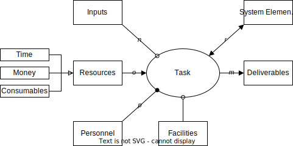
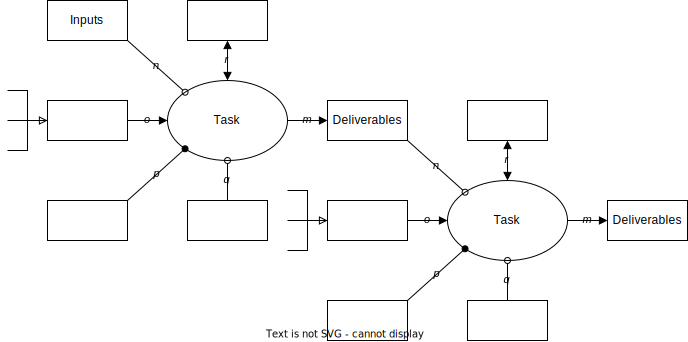
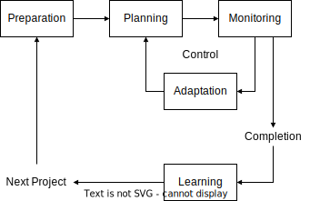

# SPM Concepts

Notes from ESD.36

## Project

Project = set of tasks that:

* are related to each other
* have a specific objective to be completed within certain specifications
* have defined start and end dates
* have funding limits
* consume resources

## Iron Triangle

Project:

* Constraints: Scope
* Variables: Cost, Schedule

## System

System = set of physical/virtual objects whose interrelationships enable desired function(s).

* More than the sum of its parts
* Undesired (emergent) functions often exist
* System complexity scales with the number of objects as well as the type and number of interconnections between them
* Instantaneously available functions, versus "lifecycle" properties (scalability, flexibility, robustness, etc.)

Product = system sold for profit

## Project Management (PM)

Project Management (PM) = body of methods and tools that facilitate the achievement of project objectives

* Within time
* Within cost
* Within scope
* At the desired performance/specification level
* While effectively and efficiently utilizing resources
* While carefully managing risks and opportunities

## Research & Development (R&D)

| Development                | Structured | Planning | Predictive |
| -------------------------- | ---------- | -------- | ---------- |
| Research/Technology        | False      | Hard     | False      |
| Product/System Development | True       | Easy     | True       |

## Task as an Object-Process-Diagram

|  |
| :----------------------------------------------------------------------------------------: |
|                                            Task                                            |

|  |
| :----------------------------------------------------------------------------------------------: |
|                                             Project                                             |

|  |
| :------------------------------------------------------------------: |
|                         SPM ESD.36 Framework                         |
